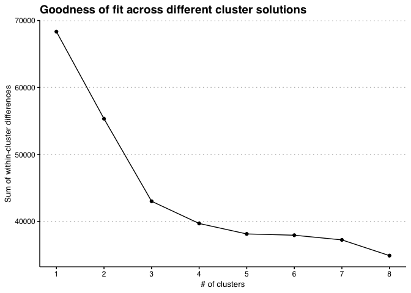
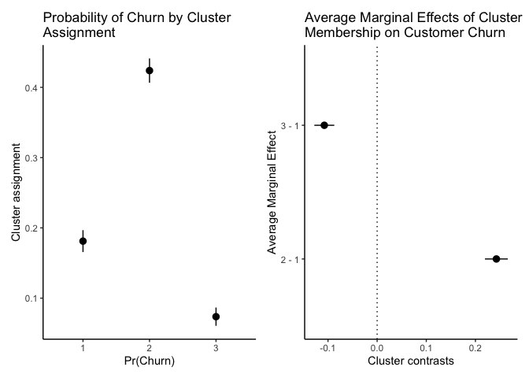

<!-- README.md is generated from README.Rmd. Please edit that file -->

# kmodesFlow

<!-- badges: start -->
<!-- badges: end -->

The goal of kmodesFlow is to improve workflow efficiency when using
kmodes models.

## Installation

You can install the development version of kmodesFlow from
[GitHub](https://github.com/) with:

``` r
# install.packages("devtools")
devtools::install_github("Sdbock/kmodesFlow")
```

## Tutorial

The *kmodesFlow* package provides convience functions to accompany the
*klaR::kmodes()* function, improving overall workflow with kmodes
modeling. To demo the functionality of the package, I will use a dataset
on Telco customer churn (see more on the data here:
<https://www.kaggle.com/datasets/blastchar/telco-customer-churn>).

## Loading data and packages

``` r
library(kmodesFlow) # loading package
library(tidyverse)
#> ── Attaching packages ─────────────────────────────────────── tidyverse 1.3.1 ──
#> ✔ ggplot2 3.3.6      ✔ purrr   0.3.5 
#> ✔ tibble  3.1.8      ✔ dplyr   1.0.10
#> ✔ tidyr   1.2.0      ✔ stringr 1.4.1 
#> ✔ readr   2.1.2      ✔ forcats 0.5.1
#> ── Conflicts ────────────────────────────────────────── tidyverse_conflicts() ──
#> ✖ dplyr::filter() masks stats::filter()
#> ✖ dplyr::lag()    masks stats::lag()

data <- read_csv("telco_customer_churn.csv") # loading data as tibble after downloading
#> Rows: 7043 Columns: 21
#> ── Column specification ────────────────────────────────────────────────────────
#> Delimiter: ","
#> chr (17): customerID, gender, Partner, Dependents, PhoneService, MultipleLin...
#> dbl  (4): SeniorCitizen, tenure, MonthlyCharges, TotalCharges
#> 
#> ℹ Use `spec()` to retrieve the full column specification for this data.
#> ℹ Specify the column types or set `show_col_types = FALSE` to quiet this message.

glimpse(data)
#> Rows: 7,043
#> Columns: 21
#> $ customerID       <chr> "7590-VHVEG", "5575-GNVDE", "3668-QPYBK", "7795-CFOCW…
#> $ gender           <chr> "Female", "Male", "Male", "Male", "Female", "Female",…
#> $ SeniorCitizen    <dbl> 0, 0, 0, 0, 0, 0, 0, 0, 0, 0, 0, 0, 0, 0, 0, 0, 0, 0,…
#> $ Partner          <chr> "Yes", "No", "No", "No", "No", "No", "No", "No", "Yes…
#> $ Dependents       <chr> "No", "No", "No", "No", "No", "No", "Yes", "No", "No"…
#> $ tenure           <dbl> 1, 34, 2, 45, 2, 8, 22, 10, 28, 62, 13, 16, 58, 49, 2…
#> $ PhoneService     <chr> "No", "Yes", "Yes", "No", "Yes", "Yes", "Yes", "No", …
#> $ MultipleLines    <chr> "No phone service", "No", "No", "No phone service", "…
#> $ InternetService  <chr> "DSL", "DSL", "DSL", "DSL", "Fiber optic", "Fiber opt…
#> $ OnlineSecurity   <chr> "No", "Yes", "Yes", "Yes", "No", "No", "No", "Yes", "…
#> $ OnlineBackup     <chr> "Yes", "No", "Yes", "No", "No", "No", "Yes", "No", "N…
#> $ DeviceProtection <chr> "No", "Yes", "No", "Yes", "No", "Yes", "No", "No", "Y…
#> $ TechSupport      <chr> "No", "No", "No", "Yes", "No", "No", "No", "No", "Yes…
#> $ StreamingTV      <chr> "No", "No", "No", "No", "No", "Yes", "Yes", "No", "Ye…
#> $ StreamingMovies  <chr> "No", "No", "No", "No", "No", "Yes", "No", "No", "Yes…
#> $ Contract         <chr> "Month-to-month", "One year", "Month-to-month", "One …
#> $ PaperlessBilling <chr> "Yes", "No", "Yes", "No", "Yes", "Yes", "Yes", "No", …
#> $ PaymentMethod    <chr> "Electronic check", "Mailed check", "Mailed check", "…
#> $ MonthlyCharges   <dbl> 29.85, 56.95, 53.85, 42.30, 70.70, 99.65, 89.10, 29.7…
#> $ TotalCharges     <dbl> 29.85, 1889.50, 108.15, 1840.75, 151.65, 820.50, 1949…
#> $ Churn            <chr> "No", "No", "Yes", "No", "Yes", "Yes", "No", "No", "Y…
```

## Cleaning data

The data contains several categorical variables on customer behavior and
details about their accounts. The outcome of interest here is the
“Churn” variable. Are there certain latent groups of customers based on
the available variables, and are these groups predictive of customer
church? This is a task for kmodes clustering!

The workhorse of the *kmodesFlow* package is the *fit_models()*
function. Because we do not know the optimal numbers of clusters
beforehand, we must run several models, and select the number of
clusters based on model fit and substantive interpretation.
*fit_models()* allows us to easily run multiple models, trying out
different values of
.
Let’s fit 8 models, with 1:8 k-clustering solutions. I will also set a
seed, so that we can reproduce results if wanted.

Before we fit our models, there is a bit of data cleaning that needs to
be done. The *MonthlyCharges*, *TotalCharges*, *Tenure*, and
*SeniorCitizen* variables are all coded as numeric. To include these
variables in our model, we must convert these into categorical
variables.

``` r
# converting continuous variables into categorical by quartiles
data_r <- 
  data %>%
  mutate(SeniorCitizen = if_else(SeniorCitizen == 1, "Yes", "No"),
         MonthlyCharges = as.character(ntile(MonthlyCharges, 4)), 
         TotalCharges = as.character(ntile(TotalCharges, 4)),
         tenure = as.character(ntile(tenure, 4)))

glimpse(data_r)
#> Rows: 7,043
#> Columns: 21
#> $ customerID       <chr> "7590-VHVEG", "5575-GNVDE", "3668-QPYBK", "7795-CFOCW…
#> $ gender           <chr> "Female", "Male", "Male", "Male", "Female", "Female",…
#> $ SeniorCitizen    <chr> "No", "No", "No", "No", "No", "No", "No", "No", "No",…
#> $ Partner          <chr> "Yes", "No", "No", "No", "No", "No", "No", "No", "Yes…
#> $ Dependents       <chr> "No", "No", "No", "No", "No", "No", "Yes", "No", "No"…
#> $ tenure           <chr> "1", "3", "1", "3", "1", "1", "2", "2", "2", "4", "2"…
#> $ PhoneService     <chr> "No", "Yes", "Yes", "No", "Yes", "Yes", "Yes", "No", …
#> $ MultipleLines    <chr> "No phone service", "No", "No", "No phone service", "…
#> $ InternetService  <chr> "DSL", "DSL", "DSL", "DSL", "Fiber optic", "Fiber opt…
#> $ OnlineSecurity   <chr> "No", "Yes", "Yes", "Yes", "No", "No", "No", "Yes", "…
#> $ OnlineBackup     <chr> "Yes", "No", "Yes", "No", "No", "No", "Yes", "No", "N…
#> $ DeviceProtection <chr> "No", "Yes", "No", "Yes", "No", "Yes", "No", "No", "Y…
#> $ TechSupport      <chr> "No", "No", "No", "Yes", "No", "No", "No", "No", "Yes…
#> $ StreamingTV      <chr> "No", "No", "No", "No", "No", "Yes", "Yes", "No", "Ye…
#> $ StreamingMovies  <chr> "No", "No", "No", "No", "No", "Yes", "No", "No", "Yes…
#> $ Contract         <chr> "Month-to-month", "One year", "Month-to-month", "One …
#> $ PaperlessBilling <chr> "Yes", "No", "Yes", "No", "Yes", "Yes", "Yes", "No", …
#> $ PaymentMethod    <chr> "Electronic check", "Mailed check", "Mailed check", "…
#> $ MonthlyCharges   <chr> "1", "2", "2", "2", "3", "4", "3", "1", "4", "2", "2"…
#> $ TotalCharges     <chr> "1", "3", "1", "3", "1", "2", "3", "1", "3", "3", "2"…
#> $ Churn            <chr> "No", "No", "Yes", "No", "Yes", "Yes", "No", "No", "Y…
```

Next, we need to check for missing values, as fit_models() only excepts
columns with non-missing data.

``` r
sum(is.na(data_r))
#> [1] 11
```

Looks like there are 11 missing values. Because there are only 11, let’s
go ahead and delete them.

``` r
data_r <-
  data_r %>% 
  drop_na()

sum(is.na(data_r))
#> [1] 0
```

Great, now we have all categorical variables with no missing values.
We’re ready to fit our models.

## Fitting models

``` r
models_fit <- 
  fit_models(data = data_r %>% 
                    select(-c(Churn, customerID)), # removing ID and outcome variable (churn)
             k = 1:8, # specificying 1 through 8 values for k
             seed = 1234) # setting random seed
#> 
#> Attaching package: 'magrittr'
#> The following object is masked from 'package:purrr':
#> 
#>     set_names
#> The following object is masked from 'package:tidyr':
#> 
#>     extract
#> Joining, by = c("cluster", "vars")
#> Joining, by = c("cluster", "vars")
#> Joining, by = c("cluster", "vars")
#> Joining, by = c("cluster", "vars")
#> Joining, by = c("cluster", "vars")
#> Joining, by = c("cluster", "vars")
#> Joining, by = c("cluster", "vars")
#> Joining, by = c("cluster", "vars")
```

``` r
glimpse(models_fit)
#> Rows: 8
#> Columns: 8
#> $ k                            <int> 1, 2, 3, 4, 5, 6, 7, 8
#> $ model                        <list> [1, 1, 1, 1, 1, 1, 1, 1, 1, 1, 1, 1, 1, 1…
#> $ gof                          <list> 68337, 55333, 43009, 39691, 38127, 37936…
#> $ cluster_distribution         <list> [<tbl_df[1 x 3]>], [<tbl_df[2 x 3]>], [<…
#> $ df                           <list> [<tbl_df[7032 x 20]>], [<tbl_df[7032 x 2…
#> $ attribute_distribution       <list> [<tbl_df[55 x 4]>], [<tbl_df[110 x 4]>],…
#> $ table_attribute_distribution <list> [[<tbl_df[55 x 3]>], [<tbl_df[3 x 6]>], …
#> $ table_cluster_modes          <list> [[<tbl_df[55 x 3]>], [<tbl_df[3 x 6]>], …
```

*fit_models()* returns a large tibble containing various information
about each model. Each row in the tibble pertains to a separate model
specification.

## Assessing model fit

Which value of

should we use? The *plot_elbow()* function takes the model output, and
plots the within-cluster sum of squares, allowing users to quickly
implement the “elbow method” to identify the number of clusters.

``` r
plot_elbow(models_fit)
```



Based on the elbow plot, it appears that 3 clusters is our optimal
solution, with 4 also being a possibilty. Let’s go ahead with the
3-cluster solution. What do these clusters look like? The output from
*fit_models()* contains two tables to analyze the profile of each
cluster.

## Assessing clusters

The first table identifies the modal category for each variable within
each cluster. It also dispalys the relative proportions of each cluster.
To view this table, we simply print the table for the 3-cluster solution
within our *models_fit* tibble.

``` r
pluck(models_fit, "table_cluster_modes", 3) # priting the table_cluster_modes column in the 3rd row
```

<div id="buirhkagic" style="overflow-x:auto;overflow-y:auto;width:auto;height:auto;">
<style>html {
  font-family: -apple-system, BlinkMacSystemFont, 'Segoe UI', Roboto, Oxygen, Ubuntu, Cantarell, 'Helvetica Neue', 'Fira Sans', 'Droid Sans', Arial, sans-serif;
}

#buirhkagic .gt_table {
  display: table;
  border-collapse: collapse;
  margin-left: auto;
  margin-right: auto;
  color: #333333;
  font-size: 16px;
  font-weight: normal;
  font-style: normal;
  background-color: #FFFFFF;
  width: auto;
  border-top-style: solid;
  border-top-width: 2px;
  border-top-color: #A8A8A8;
  border-right-style: none;
  border-right-width: 2px;
  border-right-color: #D3D3D3;
  border-bottom-style: solid;
  border-bottom-width: 2px;
  border-bottom-color: #A8A8A8;
  border-left-style: none;
  border-left-width: 2px;
  border-left-color: #D3D3D3;
}

#buirhkagic .gt_heading {
  background-color: #FFFFFF;
  text-align: center;
  border-bottom-color: #FFFFFF;
  border-left-style: none;
  border-left-width: 1px;
  border-left-color: #D3D3D3;
  border-right-style: none;
  border-right-width: 1px;
  border-right-color: #D3D3D3;
}

#buirhkagic .gt_title {
  color: #333333;
  font-size: 125%;
  font-weight: initial;
  padding-top: 4px;
  padding-bottom: 4px;
  padding-left: 5px;
  padding-right: 5px;
  border-bottom-color: #FFFFFF;
  border-bottom-width: 0;
}

#buirhkagic .gt_subtitle {
  color: #333333;
  font-size: 85%;
  font-weight: initial;
  padding-top: 0;
  padding-bottom: 6px;
  padding-left: 5px;
  padding-right: 5px;
  border-top-color: #FFFFFF;
  border-top-width: 0;
}

#buirhkagic .gt_bottom_border {
  border-bottom-style: solid;
  border-bottom-width: 2px;
  border-bottom-color: #D3D3D3;
}

#buirhkagic .gt_col_headings {
  border-top-style: solid;
  border-top-width: 2px;
  border-top-color: #D3D3D3;
  border-bottom-style: solid;
  border-bottom-width: 2px;
  border-bottom-color: #D3D3D3;
  border-left-style: none;
  border-left-width: 1px;
  border-left-color: #D3D3D3;
  border-right-style: none;
  border-right-width: 1px;
  border-right-color: #D3D3D3;
}

#buirhkagic .gt_col_heading {
  color: #333333;
  background-color: #FFFFFF;
  font-size: 100%;
  font-weight: normal;
  text-transform: inherit;
  border-left-style: none;
  border-left-width: 1px;
  border-left-color: #D3D3D3;
  border-right-style: none;
  border-right-width: 1px;
  border-right-color: #D3D3D3;
  vertical-align: bottom;
  padding-top: 5px;
  padding-bottom: 6px;
  padding-left: 5px;
  padding-right: 5px;
  overflow-x: hidden;
}

#buirhkagic .gt_column_spanner_outer {
  color: #333333;
  background-color: #FFFFFF;
  font-size: 100%;
  font-weight: normal;
  text-transform: inherit;
  padding-top: 0;
  padding-bottom: 0;
  padding-left: 4px;
  padding-right: 4px;
}

#buirhkagic .gt_column_spanner_outer:first-child {
  padding-left: 0;
}

#buirhkagic .gt_column_spanner_outer:last-child {
  padding-right: 0;
}

#buirhkagic .gt_column_spanner {
  border-bottom-style: solid;
  border-bottom-width: 2px;
  border-bottom-color: #D3D3D3;
  vertical-align: bottom;
  padding-top: 5px;
  padding-bottom: 5px;
  overflow-x: hidden;
  display: inline-block;
  width: 100%;
}

#buirhkagic .gt_group_heading {
  padding-top: 8px;
  padding-bottom: 8px;
  padding-left: 5px;
  padding-right: 5px;
  color: #333333;
  background-color: #FFFFFF;
  font-size: 100%;
  font-weight: initial;
  text-transform: inherit;
  border-top-style: solid;
  border-top-width: 2px;
  border-top-color: #D3D3D3;
  border-bottom-style: solid;
  border-bottom-width: 2px;
  border-bottom-color: #D3D3D3;
  border-left-style: none;
  border-left-width: 1px;
  border-left-color: #D3D3D3;
  border-right-style: none;
  border-right-width: 1px;
  border-right-color: #D3D3D3;
  vertical-align: middle;
}

#buirhkagic .gt_empty_group_heading {
  padding: 0.5px;
  color: #333333;
  background-color: #FFFFFF;
  font-size: 100%;
  font-weight: initial;
  border-top-style: solid;
  border-top-width: 2px;
  border-top-color: #D3D3D3;
  border-bottom-style: solid;
  border-bottom-width: 2px;
  border-bottom-color: #D3D3D3;
  vertical-align: middle;
}

#buirhkagic .gt_from_md > :first-child {
  margin-top: 0;
}

#buirhkagic .gt_from_md > :last-child {
  margin-bottom: 0;
}

#buirhkagic .gt_row {
  padding-top: 8px;
  padding-bottom: 8px;
  padding-left: 5px;
  padding-right: 5px;
  margin: 10px;
  border-top-style: solid;
  border-top-width: 1px;
  border-top-color: #D3D3D3;
  border-left-style: none;
  border-left-width: 1px;
  border-left-color: #D3D3D3;
  border-right-style: none;
  border-right-width: 1px;
  border-right-color: #D3D3D3;
  vertical-align: middle;
  overflow-x: hidden;
}

#buirhkagic .gt_stub {
  color: #333333;
  background-color: #FFFFFF;
  font-size: 100%;
  font-weight: initial;
  text-transform: inherit;
  border-right-style: solid;
  border-right-width: 2px;
  border-right-color: #D3D3D3;
  padding-left: 5px;
  padding-right: 5px;
}

#buirhkagic .gt_stub_row_group {
  color: #333333;
  background-color: #FFFFFF;
  font-size: 100%;
  font-weight: initial;
  text-transform: inherit;
  border-right-style: solid;
  border-right-width: 2px;
  border-right-color: #D3D3D3;
  padding-left: 5px;
  padding-right: 5px;
  vertical-align: top;
}

#buirhkagic .gt_row_group_first td {
  border-top-width: 2px;
}

#buirhkagic .gt_summary_row {
  color: #333333;
  background-color: #FFFFFF;
  text-transform: inherit;
  padding-top: 8px;
  padding-bottom: 8px;
  padding-left: 5px;
  padding-right: 5px;
}

#buirhkagic .gt_first_summary_row {
  border-top-style: solid;
  border-top-color: #D3D3D3;
}

#buirhkagic .gt_first_summary_row.thick {
  border-top-width: 2px;
}

#buirhkagic .gt_last_summary_row {
  padding-top: 8px;
  padding-bottom: 8px;
  padding-left: 5px;
  padding-right: 5px;
  border-bottom-style: solid;
  border-bottom-width: 2px;
  border-bottom-color: #D3D3D3;
}

#buirhkagic .gt_grand_summary_row {
  color: #333333;
  background-color: #FFFFFF;
  text-transform: inherit;
  padding-top: 8px;
  padding-bottom: 8px;
  padding-left: 5px;
  padding-right: 5px;
}

#buirhkagic .gt_first_grand_summary_row {
  padding-top: 8px;
  padding-bottom: 8px;
  padding-left: 5px;
  padding-right: 5px;
  border-top-style: double;
  border-top-width: 6px;
  border-top-color: #D3D3D3;
}

#buirhkagic .gt_striped {
  background-color: rgba(128, 128, 128, 0.05);
}

#buirhkagic .gt_table_body {
  border-top-style: solid;
  border-top-width: 2px;
  border-top-color: #D3D3D3;
  border-bottom-style: solid;
  border-bottom-width: 2px;
  border-bottom-color: #D3D3D3;
}

#buirhkagic .gt_footnotes {
  color: #333333;
  background-color: #FFFFFF;
  border-bottom-style: none;
  border-bottom-width: 2px;
  border-bottom-color: #D3D3D3;
  border-left-style: none;
  border-left-width: 2px;
  border-left-color: #D3D3D3;
  border-right-style: none;
  border-right-width: 2px;
  border-right-color: #D3D3D3;
}

#buirhkagic .gt_footnote {
  margin: 0px;
  font-size: 90%;
  padding-left: 4px;
  padding-right: 4px;
  padding-left: 5px;
  padding-right: 5px;
}

#buirhkagic .gt_sourcenotes {
  color: #333333;
  background-color: #FFFFFF;
  border-bottom-style: none;
  border-bottom-width: 2px;
  border-bottom-color: #D3D3D3;
  border-left-style: none;
  border-left-width: 2px;
  border-left-color: #D3D3D3;
  border-right-style: none;
  border-right-width: 2px;
  border-right-color: #D3D3D3;
}

#buirhkagic .gt_sourcenote {
  font-size: 90%;
  padding-top: 4px;
  padding-bottom: 4px;
  padding-left: 5px;
  padding-right: 5px;
}

#buirhkagic .gt_left {
  text-align: left;
}

#buirhkagic .gt_center {
  text-align: center;
}

#buirhkagic .gt_right {
  text-align: right;
  font-variant-numeric: tabular-nums;
}

#buirhkagic .gt_font_normal {
  font-weight: normal;
}

#buirhkagic .gt_font_bold {
  font-weight: bold;
}

#buirhkagic .gt_font_italic {
  font-style: italic;
}

#buirhkagic .gt_super {
  font-size: 65%;
}

#buirhkagic .gt_two_val_uncert {
  display: inline-block;
  line-height: 1em;
  text-align: right;
  font-size: 60%;
  vertical-align: -0.25em;
  margin-left: 0.1em;
}

#buirhkagic .gt_footnote_marks {
  font-style: italic;
  font-weight: normal;
  font-size: 75%;
  vertical-align: 0.4em;
}

#buirhkagic .gt_asterisk {
  font-size: 100%;
  vertical-align: 0;
}

#buirhkagic .gt_slash_mark {
  font-size: 0.7em;
  line-height: 0.7em;
  vertical-align: 0.15em;
}

#buirhkagic .gt_fraction_numerator {
  font-size: 0.6em;
  line-height: 0.6em;
  vertical-align: 0.45em;
}

#buirhkagic .gt_fraction_denominator {
  font-size: 0.6em;
  line-height: 0.6em;
  vertical-align: -0.05em;
}
</style>
<table class="gt_table">
  <thead class="gt_header">
    <tr>
      <th colspan="4" class="gt_heading gt_title gt_font_normal gt_bottom_border" style>Cluster modes</th>
    </tr>
    
  </thead>
  <thead class="gt_col_headings">
    <tr>
      <th class="gt_col_heading gt_columns_bottom_border gt_center" rowspan="1" colspan="1">Attributes</th>
      <th class="gt_col_heading gt_columns_bottom_border gt_center" rowspan="1" colspan="1">Cluster 1
(33%)</th>
      <th class="gt_col_heading gt_columns_bottom_border gt_center" rowspan="1" colspan="1">Cluster 2
(45%)</th>
      <th class="gt_col_heading gt_columns_bottom_border gt_center" rowspan="1" colspan="1">Cluster 3
(22%)</th>
    </tr>
  </thead>
  <tbody class="gt_table_body">
    <tr class="gt_group_heading_row">
      <td colspan="4" class="gt_group_heading">Contract</td>
    </tr>
    <tr class="gt_row_group_first"><td class="gt_row gt_center">Month-to-month</td>
<td class="gt_row gt_center">&nbsp;</td>
<td class="gt_row gt_center"><div title="check" aria-label="check" role="img" style="padding:0px"><svg aria-label="Check" role="img" viewBox="0 0 448 512" style="height:20px;width:17.5px;vertical-align:-0.125em;margin-left:auto;margin-right:auto;font-size:inherit;fill:#000000;overflow:visible;position:relative;"><title>Check</title><path d="M438.6 105.4C451.1 117.9 451.1 138.1 438.6 150.6L182.6 406.6C170.1 419.1 149.9 419.1 137.4 406.6L9.372 278.6C-3.124 266.1-3.124 245.9 9.372 233.4C21.87 220.9 42.13 220.9 54.63 233.4L159.1 338.7L393.4 105.4C405.9 92.88 426.1 92.88 438.6 105.4H438.6z"/></svg></div></td>
<td class="gt_row gt_center">&nbsp;</td></tr>
    <tr><td class="gt_row gt_center">One year</td>
<td class="gt_row gt_center">&nbsp;</td>
<td class="gt_row gt_center">&nbsp;</td>
<td class="gt_row gt_center">&nbsp;</td></tr>
    <tr><td class="gt_row gt_center">Two year</td>
<td class="gt_row gt_center"><div title="check" aria-label="check" role="img" style="padding:0px"><svg aria-label="Check" role="img" viewBox="0 0 448 512" style="height:20px;width:17.5px;vertical-align:-0.125em;margin-left:auto;margin-right:auto;font-size:inherit;fill:#000000;overflow:visible;position:relative;"><title>Check</title><path d="M438.6 105.4C451.1 117.9 451.1 138.1 438.6 150.6L182.6 406.6C170.1 419.1 149.9 419.1 137.4 406.6L9.372 278.6C-3.124 266.1-3.124 245.9 9.372 233.4C21.87 220.9 42.13 220.9 54.63 233.4L159.1 338.7L393.4 105.4C405.9 92.88 426.1 92.88 438.6 105.4H438.6z"/></svg></div></td>
<td class="gt_row gt_center">&nbsp;</td>
<td class="gt_row gt_center"><div title="check" aria-label="check" role="img" style="padding:0px"><svg aria-label="Check" role="img" viewBox="0 0 448 512" style="height:20px;width:17.5px;vertical-align:-0.125em;margin-left:auto;margin-right:auto;font-size:inherit;fill:#000000;overflow:visible;position:relative;"><title>Check</title><path d="M438.6 105.4C451.1 117.9 451.1 138.1 438.6 150.6L182.6 406.6C170.1 419.1 149.9 419.1 137.4 406.6L9.372 278.6C-3.124 266.1-3.124 245.9 9.372 233.4C21.87 220.9 42.13 220.9 54.63 233.4L159.1 338.7L393.4 105.4C405.9 92.88 426.1 92.88 438.6 105.4H438.6z"/></svg></div></td></tr>
    <tr class="gt_group_heading_row">
      <td colspan="4" class="gt_group_heading">Dependents</td>
    </tr>
    <tr class="gt_row_group_first"><td class="gt_row gt_center">No</td>
<td class="gt_row gt_center"><div title="check" aria-label="check" role="img" style="padding:0px"><svg aria-label="Check" role="img" viewBox="0 0 448 512" style="height:20px;width:17.5px;vertical-align:-0.125em;margin-left:auto;margin-right:auto;font-size:inherit;fill:#000000;overflow:visible;position:relative;"><title>Check</title><path d="M438.6 105.4C451.1 117.9 451.1 138.1 438.6 150.6L182.6 406.6C170.1 419.1 149.9 419.1 137.4 406.6L9.372 278.6C-3.124 266.1-3.124 245.9 9.372 233.4C21.87 220.9 42.13 220.9 54.63 233.4L159.1 338.7L393.4 105.4C405.9 92.88 426.1 92.88 438.6 105.4H438.6z"/></svg></div></td>
<td class="gt_row gt_center"><div title="check" aria-label="check" role="img" style="padding:0px"><svg aria-label="Check" role="img" viewBox="0 0 448 512" style="height:20px;width:17.5px;vertical-align:-0.125em;margin-left:auto;margin-right:auto;font-size:inherit;fill:#000000;overflow:visible;position:relative;"><title>Check</title><path d="M438.6 105.4C451.1 117.9 451.1 138.1 438.6 150.6L182.6 406.6C170.1 419.1 149.9 419.1 137.4 406.6L9.372 278.6C-3.124 266.1-3.124 245.9 9.372 233.4C21.87 220.9 42.13 220.9 54.63 233.4L159.1 338.7L393.4 105.4C405.9 92.88 426.1 92.88 438.6 105.4H438.6z"/></svg></div></td>
<td class="gt_row gt_center"><div title="check" aria-label="check" role="img" style="padding:0px"><svg aria-label="Check" role="img" viewBox="0 0 448 512" style="height:20px;width:17.5px;vertical-align:-0.125em;margin-left:auto;margin-right:auto;font-size:inherit;fill:#000000;overflow:visible;position:relative;"><title>Check</title><path d="M438.6 105.4C451.1 117.9 451.1 138.1 438.6 150.6L182.6 406.6C170.1 419.1 149.9 419.1 137.4 406.6L9.372 278.6C-3.124 266.1-3.124 245.9 9.372 233.4C21.87 220.9 42.13 220.9 54.63 233.4L159.1 338.7L393.4 105.4C405.9 92.88 426.1 92.88 438.6 105.4H438.6z"/></svg></div></td></tr>
    <tr><td class="gt_row gt_center">Yes</td>
<td class="gt_row gt_center">&nbsp;</td>
<td class="gt_row gt_center">&nbsp;</td>
<td class="gt_row gt_center">&nbsp;</td></tr>
    <tr class="gt_group_heading_row">
      <td colspan="4" class="gt_group_heading">DeviceProtection</td>
    </tr>
    <tr class="gt_row_group_first"><td class="gt_row gt_center">No</td>
<td class="gt_row gt_center">&nbsp;</td>
<td class="gt_row gt_center"><div title="check" aria-label="check" role="img" style="padding:0px"><svg aria-label="Check" role="img" viewBox="0 0 448 512" style="height:20px;width:17.5px;vertical-align:-0.125em;margin-left:auto;margin-right:auto;font-size:inherit;fill:#000000;overflow:visible;position:relative;"><title>Check</title><path d="M438.6 105.4C451.1 117.9 451.1 138.1 438.6 150.6L182.6 406.6C170.1 419.1 149.9 419.1 137.4 406.6L9.372 278.6C-3.124 266.1-3.124 245.9 9.372 233.4C21.87 220.9 42.13 220.9 54.63 233.4L159.1 338.7L393.4 105.4C405.9 92.88 426.1 92.88 438.6 105.4H438.6z"/></svg></div></td>
<td class="gt_row gt_center">&nbsp;</td></tr>
    <tr><td class="gt_row gt_center">Yes</td>
<td class="gt_row gt_center"><div title="check" aria-label="check" role="img" style="padding:0px"><svg aria-label="Check" role="img" viewBox="0 0 448 512" style="height:20px;width:17.5px;vertical-align:-0.125em;margin-left:auto;margin-right:auto;font-size:inherit;fill:#000000;overflow:visible;position:relative;"><title>Check</title><path d="M438.6 105.4C451.1 117.9 451.1 138.1 438.6 150.6L182.6 406.6C170.1 419.1 149.9 419.1 137.4 406.6L9.372 278.6C-3.124 266.1-3.124 245.9 9.372 233.4C21.87 220.9 42.13 220.9 54.63 233.4L159.1 338.7L393.4 105.4C405.9 92.88 426.1 92.88 438.6 105.4H438.6z"/></svg></div></td>
<td class="gt_row gt_center">&nbsp;</td>
<td class="gt_row gt_center">&nbsp;</td></tr>
    <tr><td class="gt_row gt_center">No internet service</td>
<td class="gt_row gt_center">&nbsp;</td>
<td class="gt_row gt_center">&nbsp;</td>
<td class="gt_row gt_center"><div title="check" aria-label="check" role="img" style="padding:0px"><svg aria-label="Check" role="img" viewBox="0 0 448 512" style="height:20px;width:17.5px;vertical-align:-0.125em;margin-left:auto;margin-right:auto;font-size:inherit;fill:#000000;overflow:visible;position:relative;"><title>Check</title><path d="M438.6 105.4C451.1 117.9 451.1 138.1 438.6 150.6L182.6 406.6C170.1 419.1 149.9 419.1 137.4 406.6L9.372 278.6C-3.124 266.1-3.124 245.9 9.372 233.4C21.87 220.9 42.13 220.9 54.63 233.4L159.1 338.7L393.4 105.4C405.9 92.88 426.1 92.88 438.6 105.4H438.6z"/></svg></div></td></tr>
    <tr class="gt_group_heading_row">
      <td colspan="4" class="gt_group_heading">gender</td>
    </tr>
    <tr class="gt_row_group_first"><td class="gt_row gt_center">Female</td>
<td class="gt_row gt_center">&nbsp;</td>
<td class="gt_row gt_center"><div title="check" aria-label="check" role="img" style="padding:0px"><svg aria-label="Check" role="img" viewBox="0 0 448 512" style="height:20px;width:17.5px;vertical-align:-0.125em;margin-left:auto;margin-right:auto;font-size:inherit;fill:#000000;overflow:visible;position:relative;"><title>Check</title><path d="M438.6 105.4C451.1 117.9 451.1 138.1 438.6 150.6L182.6 406.6C170.1 419.1 149.9 419.1 137.4 406.6L9.372 278.6C-3.124 266.1-3.124 245.9 9.372 233.4C21.87 220.9 42.13 220.9 54.63 233.4L159.1 338.7L393.4 105.4C405.9 92.88 426.1 92.88 438.6 105.4H438.6z"/></svg></div></td>
<td class="gt_row gt_center">&nbsp;</td></tr>
    <tr><td class="gt_row gt_center">Male</td>
<td class="gt_row gt_center"><div title="check" aria-label="check" role="img" style="padding:0px"><svg aria-label="Check" role="img" viewBox="0 0 448 512" style="height:20px;width:17.5px;vertical-align:-0.125em;margin-left:auto;margin-right:auto;font-size:inherit;fill:#000000;overflow:visible;position:relative;"><title>Check</title><path d="M438.6 105.4C451.1 117.9 451.1 138.1 438.6 150.6L182.6 406.6C170.1 419.1 149.9 419.1 137.4 406.6L9.372 278.6C-3.124 266.1-3.124 245.9 9.372 233.4C21.87 220.9 42.13 220.9 54.63 233.4L159.1 338.7L393.4 105.4C405.9 92.88 426.1 92.88 438.6 105.4H438.6z"/></svg></div></td>
<td class="gt_row gt_center">&nbsp;</td>
<td class="gt_row gt_center"><div title="check" aria-label="check" role="img" style="padding:0px"><svg aria-label="Check" role="img" viewBox="0 0 448 512" style="height:20px;width:17.5px;vertical-align:-0.125em;margin-left:auto;margin-right:auto;font-size:inherit;fill:#000000;overflow:visible;position:relative;"><title>Check</title><path d="M438.6 105.4C451.1 117.9 451.1 138.1 438.6 150.6L182.6 406.6C170.1 419.1 149.9 419.1 137.4 406.6L9.372 278.6C-3.124 266.1-3.124 245.9 9.372 233.4C21.87 220.9 42.13 220.9 54.63 233.4L159.1 338.7L393.4 105.4C405.9 92.88 426.1 92.88 438.6 105.4H438.6z"/></svg></div></td></tr>
    <tr class="gt_group_heading_row">
      <td colspan="4" class="gt_group_heading">InternetService</td>
    </tr>
    <tr class="gt_row_group_first"><td class="gt_row gt_center">DSL</td>
<td class="gt_row gt_center">&nbsp;</td>
<td class="gt_row gt_center">&nbsp;</td>
<td class="gt_row gt_center">&nbsp;</td></tr>
    <tr><td class="gt_row gt_center">Fiber optic</td>
<td class="gt_row gt_center"><div title="check" aria-label="check" role="img" style="padding:0px"><svg aria-label="Check" role="img" viewBox="0 0 448 512" style="height:20px;width:17.5px;vertical-align:-0.125em;margin-left:auto;margin-right:auto;font-size:inherit;fill:#000000;overflow:visible;position:relative;"><title>Check</title><path d="M438.6 105.4C451.1 117.9 451.1 138.1 438.6 150.6L182.6 406.6C170.1 419.1 149.9 419.1 137.4 406.6L9.372 278.6C-3.124 266.1-3.124 245.9 9.372 233.4C21.87 220.9 42.13 220.9 54.63 233.4L159.1 338.7L393.4 105.4C405.9 92.88 426.1 92.88 438.6 105.4H438.6z"/></svg></div></td>
<td class="gt_row gt_center"><div title="check" aria-label="check" role="img" style="padding:0px"><svg aria-label="Check" role="img" viewBox="0 0 448 512" style="height:20px;width:17.5px;vertical-align:-0.125em;margin-left:auto;margin-right:auto;font-size:inherit;fill:#000000;overflow:visible;position:relative;"><title>Check</title><path d="M438.6 105.4C451.1 117.9 451.1 138.1 438.6 150.6L182.6 406.6C170.1 419.1 149.9 419.1 137.4 406.6L9.372 278.6C-3.124 266.1-3.124 245.9 9.372 233.4C21.87 220.9 42.13 220.9 54.63 233.4L159.1 338.7L393.4 105.4C405.9 92.88 426.1 92.88 438.6 105.4H438.6z"/></svg></div></td>
<td class="gt_row gt_center">&nbsp;</td></tr>
    <tr><td class="gt_row gt_center">No</td>
<td class="gt_row gt_center">&nbsp;</td>
<td class="gt_row gt_center">&nbsp;</td>
<td class="gt_row gt_center"><div title="check" aria-label="check" role="img" style="padding:0px"><svg aria-label="Check" role="img" viewBox="0 0 448 512" style="height:20px;width:17.5px;vertical-align:-0.125em;margin-left:auto;margin-right:auto;font-size:inherit;fill:#000000;overflow:visible;position:relative;"><title>Check</title><path d="M438.6 105.4C451.1 117.9 451.1 138.1 438.6 150.6L182.6 406.6C170.1 419.1 149.9 419.1 137.4 406.6L9.372 278.6C-3.124 266.1-3.124 245.9 9.372 233.4C21.87 220.9 42.13 220.9 54.63 233.4L159.1 338.7L393.4 105.4C405.9 92.88 426.1 92.88 438.6 105.4H438.6z"/></svg></div></td></tr>
    <tr class="gt_group_heading_row">
      <td colspan="4" class="gt_group_heading">MonthlyCharges</td>
    </tr>
    <tr class="gt_row_group_first"><td class="gt_row gt_center">1</td>
<td class="gt_row gt_center">&nbsp;</td>
<td class="gt_row gt_center">&nbsp;</td>
<td class="gt_row gt_center"><div title="check" aria-label="check" role="img" style="padding:0px"><svg aria-label="Check" role="img" viewBox="0 0 448 512" style="height:20px;width:17.5px;vertical-align:-0.125em;margin-left:auto;margin-right:auto;font-size:inherit;fill:#000000;overflow:visible;position:relative;"><title>Check</title><path d="M438.6 105.4C451.1 117.9 451.1 138.1 438.6 150.6L182.6 406.6C170.1 419.1 149.9 419.1 137.4 406.6L9.372 278.6C-3.124 266.1-3.124 245.9 9.372 233.4C21.87 220.9 42.13 220.9 54.63 233.4L159.1 338.7L393.4 105.4C405.9 92.88 426.1 92.88 438.6 105.4H438.6z"/></svg></div></td></tr>
    <tr><td class="gt_row gt_center">2</td>
<td class="gt_row gt_center">&nbsp;</td>
<td class="gt_row gt_center"><div title="check" aria-label="check" role="img" style="padding:0px"><svg aria-label="Check" role="img" viewBox="0 0 448 512" style="height:20px;width:17.5px;vertical-align:-0.125em;margin-left:auto;margin-right:auto;font-size:inherit;fill:#000000;overflow:visible;position:relative;"><title>Check</title><path d="M438.6 105.4C451.1 117.9 451.1 138.1 438.6 150.6L182.6 406.6C170.1 419.1 149.9 419.1 137.4 406.6L9.372 278.6C-3.124 266.1-3.124 245.9 9.372 233.4C21.87 220.9 42.13 220.9 54.63 233.4L159.1 338.7L393.4 105.4C405.9 92.88 426.1 92.88 438.6 105.4H438.6z"/></svg></div></td>
<td class="gt_row gt_center">&nbsp;</td></tr>
    <tr><td class="gt_row gt_center">3</td>
<td class="gt_row gt_center">&nbsp;</td>
<td class="gt_row gt_center">&nbsp;</td>
<td class="gt_row gt_center">&nbsp;</td></tr>
    <tr><td class="gt_row gt_center">4</td>
<td class="gt_row gt_center"><div title="check" aria-label="check" role="img" style="padding:0px"><svg aria-label="Check" role="img" viewBox="0 0 448 512" style="height:20px;width:17.5px;vertical-align:-0.125em;margin-left:auto;margin-right:auto;font-size:inherit;fill:#000000;overflow:visible;position:relative;"><title>Check</title><path d="M438.6 105.4C451.1 117.9 451.1 138.1 438.6 150.6L182.6 406.6C170.1 419.1 149.9 419.1 137.4 406.6L9.372 278.6C-3.124 266.1-3.124 245.9 9.372 233.4C21.87 220.9 42.13 220.9 54.63 233.4L159.1 338.7L393.4 105.4C405.9 92.88 426.1 92.88 438.6 105.4H438.6z"/></svg></div></td>
<td class="gt_row gt_center">&nbsp;</td>
<td class="gt_row gt_center">&nbsp;</td></tr>
    <tr class="gt_group_heading_row">
      <td colspan="4" class="gt_group_heading">MultipleLines</td>
    </tr>
    <tr class="gt_row_group_first"><td class="gt_row gt_center">No</td>
<td class="gt_row gt_center">&nbsp;</td>
<td class="gt_row gt_center"><div title="check" aria-label="check" role="img" style="padding:0px"><svg aria-label="Check" role="img" viewBox="0 0 448 512" style="height:20px;width:17.5px;vertical-align:-0.125em;margin-left:auto;margin-right:auto;font-size:inherit;fill:#000000;overflow:visible;position:relative;"><title>Check</title><path d="M438.6 105.4C451.1 117.9 451.1 138.1 438.6 150.6L182.6 406.6C170.1 419.1 149.9 419.1 137.4 406.6L9.372 278.6C-3.124 266.1-3.124 245.9 9.372 233.4C21.87 220.9 42.13 220.9 54.63 233.4L159.1 338.7L393.4 105.4C405.9 92.88 426.1 92.88 438.6 105.4H438.6z"/></svg></div></td>
<td class="gt_row gt_center"><div title="check" aria-label="check" role="img" style="padding:0px"><svg aria-label="Check" role="img" viewBox="0 0 448 512" style="height:20px;width:17.5px;vertical-align:-0.125em;margin-left:auto;margin-right:auto;font-size:inherit;fill:#000000;overflow:visible;position:relative;"><title>Check</title><path d="M438.6 105.4C451.1 117.9 451.1 138.1 438.6 150.6L182.6 406.6C170.1 419.1 149.9 419.1 137.4 406.6L9.372 278.6C-3.124 266.1-3.124 245.9 9.372 233.4C21.87 220.9 42.13 220.9 54.63 233.4L159.1 338.7L393.4 105.4C405.9 92.88 426.1 92.88 438.6 105.4H438.6z"/></svg></div></td></tr>
    <tr><td class="gt_row gt_center">Yes</td>
<td class="gt_row gt_center"><div title="check" aria-label="check" role="img" style="padding:0px"><svg aria-label="Check" role="img" viewBox="0 0 448 512" style="height:20px;width:17.5px;vertical-align:-0.125em;margin-left:auto;margin-right:auto;font-size:inherit;fill:#000000;overflow:visible;position:relative;"><title>Check</title><path d="M438.6 105.4C451.1 117.9 451.1 138.1 438.6 150.6L182.6 406.6C170.1 419.1 149.9 419.1 137.4 406.6L9.372 278.6C-3.124 266.1-3.124 245.9 9.372 233.4C21.87 220.9 42.13 220.9 54.63 233.4L159.1 338.7L393.4 105.4C405.9 92.88 426.1 92.88 438.6 105.4H438.6z"/></svg></div></td>
<td class="gt_row gt_center">&nbsp;</td>
<td class="gt_row gt_center">&nbsp;</td></tr>
    <tr><td class="gt_row gt_center">No phone service</td>
<td class="gt_row gt_center">&nbsp;</td>
<td class="gt_row gt_center">&nbsp;</td>
<td class="gt_row gt_center">&nbsp;</td></tr>
    <tr class="gt_group_heading_row">
      <td colspan="4" class="gt_group_heading">OnlineBackup</td>
    </tr>
    <tr class="gt_row_group_first"><td class="gt_row gt_center">No</td>
<td class="gt_row gt_center">&nbsp;</td>
<td class="gt_row gt_center"><div title="check" aria-label="check" role="img" style="padding:0px"><svg aria-label="Check" role="img" viewBox="0 0 448 512" style="height:20px;width:17.5px;vertical-align:-0.125em;margin-left:auto;margin-right:auto;font-size:inherit;fill:#000000;overflow:visible;position:relative;"><title>Check</title><path d="M438.6 105.4C451.1 117.9 451.1 138.1 438.6 150.6L182.6 406.6C170.1 419.1 149.9 419.1 137.4 406.6L9.372 278.6C-3.124 266.1-3.124 245.9 9.372 233.4C21.87 220.9 42.13 220.9 54.63 233.4L159.1 338.7L393.4 105.4C405.9 92.88 426.1 92.88 438.6 105.4H438.6z"/></svg></div></td>
<td class="gt_row gt_center">&nbsp;</td></tr>
    <tr><td class="gt_row gt_center">Yes</td>
<td class="gt_row gt_center"><div title="check" aria-label="check" role="img" style="padding:0px"><svg aria-label="Check" role="img" viewBox="0 0 448 512" style="height:20px;width:17.5px;vertical-align:-0.125em;margin-left:auto;margin-right:auto;font-size:inherit;fill:#000000;overflow:visible;position:relative;"><title>Check</title><path d="M438.6 105.4C451.1 117.9 451.1 138.1 438.6 150.6L182.6 406.6C170.1 419.1 149.9 419.1 137.4 406.6L9.372 278.6C-3.124 266.1-3.124 245.9 9.372 233.4C21.87 220.9 42.13 220.9 54.63 233.4L159.1 338.7L393.4 105.4C405.9 92.88 426.1 92.88 438.6 105.4H438.6z"/></svg></div></td>
<td class="gt_row gt_center">&nbsp;</td>
<td class="gt_row gt_center">&nbsp;</td></tr>
    <tr><td class="gt_row gt_center">No internet service</td>
<td class="gt_row gt_center">&nbsp;</td>
<td class="gt_row gt_center">&nbsp;</td>
<td class="gt_row gt_center"><div title="check" aria-label="check" role="img" style="padding:0px"><svg aria-label="Check" role="img" viewBox="0 0 448 512" style="height:20px;width:17.5px;vertical-align:-0.125em;margin-left:auto;margin-right:auto;font-size:inherit;fill:#000000;overflow:visible;position:relative;"><title>Check</title><path d="M438.6 105.4C451.1 117.9 451.1 138.1 438.6 150.6L182.6 406.6C170.1 419.1 149.9 419.1 137.4 406.6L9.372 278.6C-3.124 266.1-3.124 245.9 9.372 233.4C21.87 220.9 42.13 220.9 54.63 233.4L159.1 338.7L393.4 105.4C405.9 92.88 426.1 92.88 438.6 105.4H438.6z"/></svg></div></td></tr>
    <tr class="gt_group_heading_row">
      <td colspan="4" class="gt_group_heading">OnlineSecurity</td>
    </tr>
    <tr class="gt_row_group_first"><td class="gt_row gt_center">No</td>
<td class="gt_row gt_center">&nbsp;</td>
<td class="gt_row gt_center"><div title="check" aria-label="check" role="img" style="padding:0px"><svg aria-label="Check" role="img" viewBox="0 0 448 512" style="height:20px;width:17.5px;vertical-align:-0.125em;margin-left:auto;margin-right:auto;font-size:inherit;fill:#000000;overflow:visible;position:relative;"><title>Check</title><path d="M438.6 105.4C451.1 117.9 451.1 138.1 438.6 150.6L182.6 406.6C170.1 419.1 149.9 419.1 137.4 406.6L9.372 278.6C-3.124 266.1-3.124 245.9 9.372 233.4C21.87 220.9 42.13 220.9 54.63 233.4L159.1 338.7L393.4 105.4C405.9 92.88 426.1 92.88 438.6 105.4H438.6z"/></svg></div></td>
<td class="gt_row gt_center">&nbsp;</td></tr>
    <tr><td class="gt_row gt_center">Yes</td>
<td class="gt_row gt_center"><div title="check" aria-label="check" role="img" style="padding:0px"><svg aria-label="Check" role="img" viewBox="0 0 448 512" style="height:20px;width:17.5px;vertical-align:-0.125em;margin-left:auto;margin-right:auto;font-size:inherit;fill:#000000;overflow:visible;position:relative;"><title>Check</title><path d="M438.6 105.4C451.1 117.9 451.1 138.1 438.6 150.6L182.6 406.6C170.1 419.1 149.9 419.1 137.4 406.6L9.372 278.6C-3.124 266.1-3.124 245.9 9.372 233.4C21.87 220.9 42.13 220.9 54.63 233.4L159.1 338.7L393.4 105.4C405.9 92.88 426.1 92.88 438.6 105.4H438.6z"/></svg></div></td>
<td class="gt_row gt_center">&nbsp;</td>
<td class="gt_row gt_center">&nbsp;</td></tr>
    <tr><td class="gt_row gt_center">No internet service</td>
<td class="gt_row gt_center">&nbsp;</td>
<td class="gt_row gt_center">&nbsp;</td>
<td class="gt_row gt_center"><div title="check" aria-label="check" role="img" style="padding:0px"><svg aria-label="Check" role="img" viewBox="0 0 448 512" style="height:20px;width:17.5px;vertical-align:-0.125em;margin-left:auto;margin-right:auto;font-size:inherit;fill:#000000;overflow:visible;position:relative;"><title>Check</title><path d="M438.6 105.4C451.1 117.9 451.1 138.1 438.6 150.6L182.6 406.6C170.1 419.1 149.9 419.1 137.4 406.6L9.372 278.6C-3.124 266.1-3.124 245.9 9.372 233.4C21.87 220.9 42.13 220.9 54.63 233.4L159.1 338.7L393.4 105.4C405.9 92.88 426.1 92.88 438.6 105.4H438.6z"/></svg></div></td></tr>
    <tr class="gt_group_heading_row">
      <td colspan="4" class="gt_group_heading">PaperlessBilling</td>
    </tr>
    <tr class="gt_row_group_first"><td class="gt_row gt_center">No</td>
<td class="gt_row gt_center">&nbsp;</td>
<td class="gt_row gt_center">&nbsp;</td>
<td class="gt_row gt_center"><div title="check" aria-label="check" role="img" style="padding:0px"><svg aria-label="Check" role="img" viewBox="0 0 448 512" style="height:20px;width:17.5px;vertical-align:-0.125em;margin-left:auto;margin-right:auto;font-size:inherit;fill:#000000;overflow:visible;position:relative;"><title>Check</title><path d="M438.6 105.4C451.1 117.9 451.1 138.1 438.6 150.6L182.6 406.6C170.1 419.1 149.9 419.1 137.4 406.6L9.372 278.6C-3.124 266.1-3.124 245.9 9.372 233.4C21.87 220.9 42.13 220.9 54.63 233.4L159.1 338.7L393.4 105.4C405.9 92.88 426.1 92.88 438.6 105.4H438.6z"/></svg></div></td></tr>
    <tr><td class="gt_row gt_center">Yes</td>
<td class="gt_row gt_center"><div title="check" aria-label="check" role="img" style="padding:0px"><svg aria-label="Check" role="img" viewBox="0 0 448 512" style="height:20px;width:17.5px;vertical-align:-0.125em;margin-left:auto;margin-right:auto;font-size:inherit;fill:#000000;overflow:visible;position:relative;"><title>Check</title><path d="M438.6 105.4C451.1 117.9 451.1 138.1 438.6 150.6L182.6 406.6C170.1 419.1 149.9 419.1 137.4 406.6L9.372 278.6C-3.124 266.1-3.124 245.9 9.372 233.4C21.87 220.9 42.13 220.9 54.63 233.4L159.1 338.7L393.4 105.4C405.9 92.88 426.1 92.88 438.6 105.4H438.6z"/></svg></div></td>
<td class="gt_row gt_center"><div title="check" aria-label="check" role="img" style="padding:0px"><svg aria-label="Check" role="img" viewBox="0 0 448 512" style="height:20px;width:17.5px;vertical-align:-0.125em;margin-left:auto;margin-right:auto;font-size:inherit;fill:#000000;overflow:visible;position:relative;"><title>Check</title><path d="M438.6 105.4C451.1 117.9 451.1 138.1 438.6 150.6L182.6 406.6C170.1 419.1 149.9 419.1 137.4 406.6L9.372 278.6C-3.124 266.1-3.124 245.9 9.372 233.4C21.87 220.9 42.13 220.9 54.63 233.4L159.1 338.7L393.4 105.4C405.9 92.88 426.1 92.88 438.6 105.4H438.6z"/></svg></div></td>
<td class="gt_row gt_center">&nbsp;</td></tr>
    <tr class="gt_group_heading_row">
      <td colspan="4" class="gt_group_heading">Partner</td>
    </tr>
    <tr class="gt_row_group_first"><td class="gt_row gt_center">No</td>
<td class="gt_row gt_center">&nbsp;</td>
<td class="gt_row gt_center"><div title="check" aria-label="check" role="img" style="padding:0px"><svg aria-label="Check" role="img" viewBox="0 0 448 512" style="height:20px;width:17.5px;vertical-align:-0.125em;margin-left:auto;margin-right:auto;font-size:inherit;fill:#000000;overflow:visible;position:relative;"><title>Check</title><path d="M438.6 105.4C451.1 117.9 451.1 138.1 438.6 150.6L182.6 406.6C170.1 419.1 149.9 419.1 137.4 406.6L9.372 278.6C-3.124 266.1-3.124 245.9 9.372 233.4C21.87 220.9 42.13 220.9 54.63 233.4L159.1 338.7L393.4 105.4C405.9 92.88 426.1 92.88 438.6 105.4H438.6z"/></svg></div></td>
<td class="gt_row gt_center"><div title="check" aria-label="check" role="img" style="padding:0px"><svg aria-label="Check" role="img" viewBox="0 0 448 512" style="height:20px;width:17.5px;vertical-align:-0.125em;margin-left:auto;margin-right:auto;font-size:inherit;fill:#000000;overflow:visible;position:relative;"><title>Check</title><path d="M438.6 105.4C451.1 117.9 451.1 138.1 438.6 150.6L182.6 406.6C170.1 419.1 149.9 419.1 137.4 406.6L9.372 278.6C-3.124 266.1-3.124 245.9 9.372 233.4C21.87 220.9 42.13 220.9 54.63 233.4L159.1 338.7L393.4 105.4C405.9 92.88 426.1 92.88 438.6 105.4H438.6z"/></svg></div></td></tr>
    <tr><td class="gt_row gt_center">Yes</td>
<td class="gt_row gt_center"><div title="check" aria-label="check" role="img" style="padding:0px"><svg aria-label="Check" role="img" viewBox="0 0 448 512" style="height:20px;width:17.5px;vertical-align:-0.125em;margin-left:auto;margin-right:auto;font-size:inherit;fill:#000000;overflow:visible;position:relative;"><title>Check</title><path d="M438.6 105.4C451.1 117.9 451.1 138.1 438.6 150.6L182.6 406.6C170.1 419.1 149.9 419.1 137.4 406.6L9.372 278.6C-3.124 266.1-3.124 245.9 9.372 233.4C21.87 220.9 42.13 220.9 54.63 233.4L159.1 338.7L393.4 105.4C405.9 92.88 426.1 92.88 438.6 105.4H438.6z"/></svg></div></td>
<td class="gt_row gt_center">&nbsp;</td>
<td class="gt_row gt_center">&nbsp;</td></tr>
    <tr class="gt_group_heading_row">
      <td colspan="4" class="gt_group_heading">PaymentMethod</td>
    </tr>
    <tr class="gt_row_group_first"><td class="gt_row gt_center">Bank transfer (automatic)</td>
<td class="gt_row gt_center">&nbsp;</td>
<td class="gt_row gt_center">&nbsp;</td>
<td class="gt_row gt_center">&nbsp;</td></tr>
    <tr><td class="gt_row gt_center">Credit card (automatic)</td>
<td class="gt_row gt_center">&nbsp;</td>
<td class="gt_row gt_center">&nbsp;</td>
<td class="gt_row gt_center">&nbsp;</td></tr>
    <tr><td class="gt_row gt_center">Electronic check</td>
<td class="gt_row gt_center"><div title="check" aria-label="check" role="img" style="padding:0px"><svg aria-label="Check" role="img" viewBox="0 0 448 512" style="height:20px;width:17.5px;vertical-align:-0.125em;margin-left:auto;margin-right:auto;font-size:inherit;fill:#000000;overflow:visible;position:relative;"><title>Check</title><path d="M438.6 105.4C451.1 117.9 451.1 138.1 438.6 150.6L182.6 406.6C170.1 419.1 149.9 419.1 137.4 406.6L9.372 278.6C-3.124 266.1-3.124 245.9 9.372 233.4C21.87 220.9 42.13 220.9 54.63 233.4L159.1 338.7L393.4 105.4C405.9 92.88 426.1 92.88 438.6 105.4H438.6z"/></svg></div></td>
<td class="gt_row gt_center"><div title="check" aria-label="check" role="img" style="padding:0px"><svg aria-label="Check" role="img" viewBox="0 0 448 512" style="height:20px;width:17.5px;vertical-align:-0.125em;margin-left:auto;margin-right:auto;font-size:inherit;fill:#000000;overflow:visible;position:relative;"><title>Check</title><path d="M438.6 105.4C451.1 117.9 451.1 138.1 438.6 150.6L182.6 406.6C170.1 419.1 149.9 419.1 137.4 406.6L9.372 278.6C-3.124 266.1-3.124 245.9 9.372 233.4C21.87 220.9 42.13 220.9 54.63 233.4L159.1 338.7L393.4 105.4C405.9 92.88 426.1 92.88 438.6 105.4H438.6z"/></svg></div></td>
<td class="gt_row gt_center">&nbsp;</td></tr>
    <tr><td class="gt_row gt_center">Mailed check</td>
<td class="gt_row gt_center">&nbsp;</td>
<td class="gt_row gt_center">&nbsp;</td>
<td class="gt_row gt_center"><div title="check" aria-label="check" role="img" style="padding:0px"><svg aria-label="Check" role="img" viewBox="0 0 448 512" style="height:20px;width:17.5px;vertical-align:-0.125em;margin-left:auto;margin-right:auto;font-size:inherit;fill:#000000;overflow:visible;position:relative;"><title>Check</title><path d="M438.6 105.4C451.1 117.9 451.1 138.1 438.6 150.6L182.6 406.6C170.1 419.1 149.9 419.1 137.4 406.6L9.372 278.6C-3.124 266.1-3.124 245.9 9.372 233.4C21.87 220.9 42.13 220.9 54.63 233.4L159.1 338.7L393.4 105.4C405.9 92.88 426.1 92.88 438.6 105.4H438.6z"/></svg></div></td></tr>
    <tr class="gt_group_heading_row">
      <td colspan="4" class="gt_group_heading">PhoneService</td>
    </tr>
    <tr class="gt_row_group_first"><td class="gt_row gt_center">No</td>
<td class="gt_row gt_center">&nbsp;</td>
<td class="gt_row gt_center">&nbsp;</td>
<td class="gt_row gt_center">&nbsp;</td></tr>
    <tr><td class="gt_row gt_center">Yes</td>
<td class="gt_row gt_center"><div title="check" aria-label="check" role="img" style="padding:0px"><svg aria-label="Check" role="img" viewBox="0 0 448 512" style="height:20px;width:17.5px;vertical-align:-0.125em;margin-left:auto;margin-right:auto;font-size:inherit;fill:#000000;overflow:visible;position:relative;"><title>Check</title><path d="M438.6 105.4C451.1 117.9 451.1 138.1 438.6 150.6L182.6 406.6C170.1 419.1 149.9 419.1 137.4 406.6L9.372 278.6C-3.124 266.1-3.124 245.9 9.372 233.4C21.87 220.9 42.13 220.9 54.63 233.4L159.1 338.7L393.4 105.4C405.9 92.88 426.1 92.88 438.6 105.4H438.6z"/></svg></div></td>
<td class="gt_row gt_center"><div title="check" aria-label="check" role="img" style="padding:0px"><svg aria-label="Check" role="img" viewBox="0 0 448 512" style="height:20px;width:17.5px;vertical-align:-0.125em;margin-left:auto;margin-right:auto;font-size:inherit;fill:#000000;overflow:visible;position:relative;"><title>Check</title><path d="M438.6 105.4C451.1 117.9 451.1 138.1 438.6 150.6L182.6 406.6C170.1 419.1 149.9 419.1 137.4 406.6L9.372 278.6C-3.124 266.1-3.124 245.9 9.372 233.4C21.87 220.9 42.13 220.9 54.63 233.4L159.1 338.7L393.4 105.4C405.9 92.88 426.1 92.88 438.6 105.4H438.6z"/></svg></div></td>
<td class="gt_row gt_center"><div title="check" aria-label="check" role="img" style="padding:0px"><svg aria-label="Check" role="img" viewBox="0 0 448 512" style="height:20px;width:17.5px;vertical-align:-0.125em;margin-left:auto;margin-right:auto;font-size:inherit;fill:#000000;overflow:visible;position:relative;"><title>Check</title><path d="M438.6 105.4C451.1 117.9 451.1 138.1 438.6 150.6L182.6 406.6C170.1 419.1 149.9 419.1 137.4 406.6L9.372 278.6C-3.124 266.1-3.124 245.9 9.372 233.4C21.87 220.9 42.13 220.9 54.63 233.4L159.1 338.7L393.4 105.4C405.9 92.88 426.1 92.88 438.6 105.4H438.6z"/></svg></div></td></tr>
    <tr class="gt_group_heading_row">
      <td colspan="4" class="gt_group_heading">SeniorCitizen</td>
    </tr>
    <tr class="gt_row_group_first"><td class="gt_row gt_center">No</td>
<td class="gt_row gt_center"><div title="check" aria-label="check" role="img" style="padding:0px"><svg aria-label="Check" role="img" viewBox="0 0 448 512" style="height:20px;width:17.5px;vertical-align:-0.125em;margin-left:auto;margin-right:auto;font-size:inherit;fill:#000000;overflow:visible;position:relative;"><title>Check</title><path d="M438.6 105.4C451.1 117.9 451.1 138.1 438.6 150.6L182.6 406.6C170.1 419.1 149.9 419.1 137.4 406.6L9.372 278.6C-3.124 266.1-3.124 245.9 9.372 233.4C21.87 220.9 42.13 220.9 54.63 233.4L159.1 338.7L393.4 105.4C405.9 92.88 426.1 92.88 438.6 105.4H438.6z"/></svg></div></td>
<td class="gt_row gt_center"><div title="check" aria-label="check" role="img" style="padding:0px"><svg aria-label="Check" role="img" viewBox="0 0 448 512" style="height:20px;width:17.5px;vertical-align:-0.125em;margin-left:auto;margin-right:auto;font-size:inherit;fill:#000000;overflow:visible;position:relative;"><title>Check</title><path d="M438.6 105.4C451.1 117.9 451.1 138.1 438.6 150.6L182.6 406.6C170.1 419.1 149.9 419.1 137.4 406.6L9.372 278.6C-3.124 266.1-3.124 245.9 9.372 233.4C21.87 220.9 42.13 220.9 54.63 233.4L159.1 338.7L393.4 105.4C405.9 92.88 426.1 92.88 438.6 105.4H438.6z"/></svg></div></td>
<td class="gt_row gt_center"><div title="check" aria-label="check" role="img" style="padding:0px"><svg aria-label="Check" role="img" viewBox="0 0 448 512" style="height:20px;width:17.5px;vertical-align:-0.125em;margin-left:auto;margin-right:auto;font-size:inherit;fill:#000000;overflow:visible;position:relative;"><title>Check</title><path d="M438.6 105.4C451.1 117.9 451.1 138.1 438.6 150.6L182.6 406.6C170.1 419.1 149.9 419.1 137.4 406.6L9.372 278.6C-3.124 266.1-3.124 245.9 9.372 233.4C21.87 220.9 42.13 220.9 54.63 233.4L159.1 338.7L393.4 105.4C405.9 92.88 426.1 92.88 438.6 105.4H438.6z"/></svg></div></td></tr>
    <tr><td class="gt_row gt_center">Yes</td>
<td class="gt_row gt_center">&nbsp;</td>
<td class="gt_row gt_center">&nbsp;</td>
<td class="gt_row gt_center">&nbsp;</td></tr>
    <tr class="gt_group_heading_row">
      <td colspan="4" class="gt_group_heading">StreamingMovies</td>
    </tr>
    <tr class="gt_row_group_first"><td class="gt_row gt_center">No</td>
<td class="gt_row gt_center">&nbsp;</td>
<td class="gt_row gt_center"><div title="check" aria-label="check" role="img" style="padding:0px"><svg aria-label="Check" role="img" viewBox="0 0 448 512" style="height:20px;width:17.5px;vertical-align:-0.125em;margin-left:auto;margin-right:auto;font-size:inherit;fill:#000000;overflow:visible;position:relative;"><title>Check</title><path d="M438.6 105.4C451.1 117.9 451.1 138.1 438.6 150.6L182.6 406.6C170.1 419.1 149.9 419.1 137.4 406.6L9.372 278.6C-3.124 266.1-3.124 245.9 9.372 233.4C21.87 220.9 42.13 220.9 54.63 233.4L159.1 338.7L393.4 105.4C405.9 92.88 426.1 92.88 438.6 105.4H438.6z"/></svg></div></td>
<td class="gt_row gt_center">&nbsp;</td></tr>
    <tr><td class="gt_row gt_center">Yes</td>
<td class="gt_row gt_center"><div title="check" aria-label="check" role="img" style="padding:0px"><svg aria-label="Check" role="img" viewBox="0 0 448 512" style="height:20px;width:17.5px;vertical-align:-0.125em;margin-left:auto;margin-right:auto;font-size:inherit;fill:#000000;overflow:visible;position:relative;"><title>Check</title><path d="M438.6 105.4C451.1 117.9 451.1 138.1 438.6 150.6L182.6 406.6C170.1 419.1 149.9 419.1 137.4 406.6L9.372 278.6C-3.124 266.1-3.124 245.9 9.372 233.4C21.87 220.9 42.13 220.9 54.63 233.4L159.1 338.7L393.4 105.4C405.9 92.88 426.1 92.88 438.6 105.4H438.6z"/></svg></div></td>
<td class="gt_row gt_center">&nbsp;</td>
<td class="gt_row gt_center">&nbsp;</td></tr>
    <tr><td class="gt_row gt_center">No internet service</td>
<td class="gt_row gt_center">&nbsp;</td>
<td class="gt_row gt_center">&nbsp;</td>
<td class="gt_row gt_center"><div title="check" aria-label="check" role="img" style="padding:0px"><svg aria-label="Check" role="img" viewBox="0 0 448 512" style="height:20px;width:17.5px;vertical-align:-0.125em;margin-left:auto;margin-right:auto;font-size:inherit;fill:#000000;overflow:visible;position:relative;"><title>Check</title><path d="M438.6 105.4C451.1 117.9 451.1 138.1 438.6 150.6L182.6 406.6C170.1 419.1 149.9 419.1 137.4 406.6L9.372 278.6C-3.124 266.1-3.124 245.9 9.372 233.4C21.87 220.9 42.13 220.9 54.63 233.4L159.1 338.7L393.4 105.4C405.9 92.88 426.1 92.88 438.6 105.4H438.6z"/></svg></div></td></tr>
    <tr class="gt_group_heading_row">
      <td colspan="4" class="gt_group_heading">StreamingTV</td>
    </tr>
    <tr class="gt_row_group_first"><td class="gt_row gt_center">No</td>
<td class="gt_row gt_center">&nbsp;</td>
<td class="gt_row gt_center"><div title="check" aria-label="check" role="img" style="padding:0px"><svg aria-label="Check" role="img" viewBox="0 0 448 512" style="height:20px;width:17.5px;vertical-align:-0.125em;margin-left:auto;margin-right:auto;font-size:inherit;fill:#000000;overflow:visible;position:relative;"><title>Check</title><path d="M438.6 105.4C451.1 117.9 451.1 138.1 438.6 150.6L182.6 406.6C170.1 419.1 149.9 419.1 137.4 406.6L9.372 278.6C-3.124 266.1-3.124 245.9 9.372 233.4C21.87 220.9 42.13 220.9 54.63 233.4L159.1 338.7L393.4 105.4C405.9 92.88 426.1 92.88 438.6 105.4H438.6z"/></svg></div></td>
<td class="gt_row gt_center">&nbsp;</td></tr>
    <tr><td class="gt_row gt_center">Yes</td>
<td class="gt_row gt_center"><div title="check" aria-label="check" role="img" style="padding:0px"><svg aria-label="Check" role="img" viewBox="0 0 448 512" style="height:20px;width:17.5px;vertical-align:-0.125em;margin-left:auto;margin-right:auto;font-size:inherit;fill:#000000;overflow:visible;position:relative;"><title>Check</title><path d="M438.6 105.4C451.1 117.9 451.1 138.1 438.6 150.6L182.6 406.6C170.1 419.1 149.9 419.1 137.4 406.6L9.372 278.6C-3.124 266.1-3.124 245.9 9.372 233.4C21.87 220.9 42.13 220.9 54.63 233.4L159.1 338.7L393.4 105.4C405.9 92.88 426.1 92.88 438.6 105.4H438.6z"/></svg></div></td>
<td class="gt_row gt_center">&nbsp;</td>
<td class="gt_row gt_center">&nbsp;</td></tr>
    <tr><td class="gt_row gt_center">No internet service</td>
<td class="gt_row gt_center">&nbsp;</td>
<td class="gt_row gt_center">&nbsp;</td>
<td class="gt_row gt_center"><div title="check" aria-label="check" role="img" style="padding:0px"><svg aria-label="Check" role="img" viewBox="0 0 448 512" style="height:20px;width:17.5px;vertical-align:-0.125em;margin-left:auto;margin-right:auto;font-size:inherit;fill:#000000;overflow:visible;position:relative;"><title>Check</title><path d="M438.6 105.4C451.1 117.9 451.1 138.1 438.6 150.6L182.6 406.6C170.1 419.1 149.9 419.1 137.4 406.6L9.372 278.6C-3.124 266.1-3.124 245.9 9.372 233.4C21.87 220.9 42.13 220.9 54.63 233.4L159.1 338.7L393.4 105.4C405.9 92.88 426.1 92.88 438.6 105.4H438.6z"/></svg></div></td></tr>
    <tr class="gt_group_heading_row">
      <td colspan="4" class="gt_group_heading">TechSupport</td>
    </tr>
    <tr class="gt_row_group_first"><td class="gt_row gt_center">No</td>
<td class="gt_row gt_center">&nbsp;</td>
<td class="gt_row gt_center"><div title="check" aria-label="check" role="img" style="padding:0px"><svg aria-label="Check" role="img" viewBox="0 0 448 512" style="height:20px;width:17.5px;vertical-align:-0.125em;margin-left:auto;margin-right:auto;font-size:inherit;fill:#000000;overflow:visible;position:relative;"><title>Check</title><path d="M438.6 105.4C451.1 117.9 451.1 138.1 438.6 150.6L182.6 406.6C170.1 419.1 149.9 419.1 137.4 406.6L9.372 278.6C-3.124 266.1-3.124 245.9 9.372 233.4C21.87 220.9 42.13 220.9 54.63 233.4L159.1 338.7L393.4 105.4C405.9 92.88 426.1 92.88 438.6 105.4H438.6z"/></svg></div></td>
<td class="gt_row gt_center">&nbsp;</td></tr>
    <tr><td class="gt_row gt_center">Yes</td>
<td class="gt_row gt_center"><div title="check" aria-label="check" role="img" style="padding:0px"><svg aria-label="Check" role="img" viewBox="0 0 448 512" style="height:20px;width:17.5px;vertical-align:-0.125em;margin-left:auto;margin-right:auto;font-size:inherit;fill:#000000;overflow:visible;position:relative;"><title>Check</title><path d="M438.6 105.4C451.1 117.9 451.1 138.1 438.6 150.6L182.6 406.6C170.1 419.1 149.9 419.1 137.4 406.6L9.372 278.6C-3.124 266.1-3.124 245.9 9.372 233.4C21.87 220.9 42.13 220.9 54.63 233.4L159.1 338.7L393.4 105.4C405.9 92.88 426.1 92.88 438.6 105.4H438.6z"/></svg></div></td>
<td class="gt_row gt_center">&nbsp;</td>
<td class="gt_row gt_center">&nbsp;</td></tr>
    <tr><td class="gt_row gt_center">No internet service</td>
<td class="gt_row gt_center">&nbsp;</td>
<td class="gt_row gt_center">&nbsp;</td>
<td class="gt_row gt_center"><div title="check" aria-label="check" role="img" style="padding:0px"><svg aria-label="Check" role="img" viewBox="0 0 448 512" style="height:20px;width:17.5px;vertical-align:-0.125em;margin-left:auto;margin-right:auto;font-size:inherit;fill:#000000;overflow:visible;position:relative;"><title>Check</title><path d="M438.6 105.4C451.1 117.9 451.1 138.1 438.6 150.6L182.6 406.6C170.1 419.1 149.9 419.1 137.4 406.6L9.372 278.6C-3.124 266.1-3.124 245.9 9.372 233.4C21.87 220.9 42.13 220.9 54.63 233.4L159.1 338.7L393.4 105.4C405.9 92.88 426.1 92.88 438.6 105.4H438.6z"/></svg></div></td></tr>
    <tr class="gt_group_heading_row">
      <td colspan="4" class="gt_group_heading">tenure</td>
    </tr>
    <tr class="gt_row_group_first"><td class="gt_row gt_center">1</td>
<td class="gt_row gt_center">&nbsp;</td>
<td class="gt_row gt_center"><div title="check" aria-label="check" role="img" style="padding:0px"><svg aria-label="Check" role="img" viewBox="0 0 448 512" style="height:20px;width:17.5px;vertical-align:-0.125em;margin-left:auto;margin-right:auto;font-size:inherit;fill:#000000;overflow:visible;position:relative;"><title>Check</title><path d="M438.6 105.4C451.1 117.9 451.1 138.1 438.6 150.6L182.6 406.6C170.1 419.1 149.9 419.1 137.4 406.6L9.372 278.6C-3.124 266.1-3.124 245.9 9.372 233.4C21.87 220.9 42.13 220.9 54.63 233.4L159.1 338.7L393.4 105.4C405.9 92.88 426.1 92.88 438.6 105.4H438.6z"/></svg></div></td>
<td class="gt_row gt_center">&nbsp;</td></tr>
    <tr><td class="gt_row gt_center">2</td>
<td class="gt_row gt_center">&nbsp;</td>
<td class="gt_row gt_center">&nbsp;</td>
<td class="gt_row gt_center"><div title="check" aria-label="check" role="img" style="padding:0px"><svg aria-label="Check" role="img" viewBox="0 0 448 512" style="height:20px;width:17.5px;vertical-align:-0.125em;margin-left:auto;margin-right:auto;font-size:inherit;fill:#000000;overflow:visible;position:relative;"><title>Check</title><path d="M438.6 105.4C451.1 117.9 451.1 138.1 438.6 150.6L182.6 406.6C170.1 419.1 149.9 419.1 137.4 406.6L9.372 278.6C-3.124 266.1-3.124 245.9 9.372 233.4C21.87 220.9 42.13 220.9 54.63 233.4L159.1 338.7L393.4 105.4C405.9 92.88 426.1 92.88 438.6 105.4H438.6z"/></svg></div></td></tr>
    <tr><td class="gt_row gt_center">3</td>
<td class="gt_row gt_center">&nbsp;</td>
<td class="gt_row gt_center">&nbsp;</td>
<td class="gt_row gt_center">&nbsp;</td></tr>
    <tr><td class="gt_row gt_center">4</td>
<td class="gt_row gt_center"><div title="check" aria-label="check" role="img" style="padding:0px"><svg aria-label="Check" role="img" viewBox="0 0 448 512" style="height:20px;width:17.5px;vertical-align:-0.125em;margin-left:auto;margin-right:auto;font-size:inherit;fill:#000000;overflow:visible;position:relative;"><title>Check</title><path d="M438.6 105.4C451.1 117.9 451.1 138.1 438.6 150.6L182.6 406.6C170.1 419.1 149.9 419.1 137.4 406.6L9.372 278.6C-3.124 266.1-3.124 245.9 9.372 233.4C21.87 220.9 42.13 220.9 54.63 233.4L159.1 338.7L393.4 105.4C405.9 92.88 426.1 92.88 438.6 105.4H438.6z"/></svg></div></td>
<td class="gt_row gt_center">&nbsp;</td>
<td class="gt_row gt_center">&nbsp;</td></tr>
    <tr class="gt_group_heading_row">
      <td colspan="4" class="gt_group_heading">TotalCharges</td>
    </tr>
    <tr class="gt_row_group_first"><td class="gt_row gt_center">1</td>
<td class="gt_row gt_center">&nbsp;</td>
<td class="gt_row gt_center"><div title="check" aria-label="check" role="img" style="padding:0px"><svg aria-label="Check" role="img" viewBox="0 0 448 512" style="height:20px;width:17.5px;vertical-align:-0.125em;margin-left:auto;margin-right:auto;font-size:inherit;fill:#000000;overflow:visible;position:relative;"><title>Check</title><path d="M438.6 105.4C451.1 117.9 451.1 138.1 438.6 150.6L182.6 406.6C170.1 419.1 149.9 419.1 137.4 406.6L9.372 278.6C-3.124 266.1-3.124 245.9 9.372 233.4C21.87 220.9 42.13 220.9 54.63 233.4L159.1 338.7L393.4 105.4C405.9 92.88 426.1 92.88 438.6 105.4H438.6z"/></svg></div></td>
<td class="gt_row gt_center">&nbsp;</td></tr>
    <tr><td class="gt_row gt_center">2</td>
<td class="gt_row gt_center">&nbsp;</td>
<td class="gt_row gt_center">&nbsp;</td>
<td class="gt_row gt_center"><div title="check" aria-label="check" role="img" style="padding:0px"><svg aria-label="Check" role="img" viewBox="0 0 448 512" style="height:20px;width:17.5px;vertical-align:-0.125em;margin-left:auto;margin-right:auto;font-size:inherit;fill:#000000;overflow:visible;position:relative;"><title>Check</title><path d="M438.6 105.4C451.1 117.9 451.1 138.1 438.6 150.6L182.6 406.6C170.1 419.1 149.9 419.1 137.4 406.6L9.372 278.6C-3.124 266.1-3.124 245.9 9.372 233.4C21.87 220.9 42.13 220.9 54.63 233.4L159.1 338.7L393.4 105.4C405.9 92.88 426.1 92.88 438.6 105.4H438.6z"/></svg></div></td></tr>
    <tr><td class="gt_row gt_center">3</td>
<td class="gt_row gt_center">&nbsp;</td>
<td class="gt_row gt_center">&nbsp;</td>
<td class="gt_row gt_center">&nbsp;</td></tr>
    <tr><td class="gt_row gt_center">4</td>
<td class="gt_row gt_center"><div title="check" aria-label="check" role="img" style="padding:0px"><svg aria-label="Check" role="img" viewBox="0 0 448 512" style="height:20px;width:17.5px;vertical-align:-0.125em;margin-left:auto;margin-right:auto;font-size:inherit;fill:#000000;overflow:visible;position:relative;"><title>Check</title><path d="M438.6 105.4C451.1 117.9 451.1 138.1 438.6 150.6L182.6 406.6C170.1 419.1 149.9 419.1 137.4 406.6L9.372 278.6C-3.124 266.1-3.124 245.9 9.372 233.4C21.87 220.9 42.13 220.9 54.63 233.4L159.1 338.7L393.4 105.4C405.9 92.88 426.1 92.88 438.6 105.4H438.6z"/></svg></div></td>
<td class="gt_row gt_center">&nbsp;</td>
<td class="gt_row gt_center">&nbsp;</td></tr>
  </tbody>
  
  
</table>
</div>

Another way of viewing the make-up of each cluster is by looking at the
distribution of attribute levels within each cluster. These
distributions are displayed by a heat map in the
*table_attribute_distribution* column.

``` r
pluck(models_fit, "table_attribute_distribution", 3)
```

<div id="eesafkgnmu" style="overflow-x:auto;overflow-y:auto;width:auto;height:auto;">
<style>html {
  font-family: -apple-system, BlinkMacSystemFont, 'Segoe UI', Roboto, Oxygen, Ubuntu, Cantarell, 'Helvetica Neue', 'Fira Sans', 'Droid Sans', Arial, sans-serif;
}

#eesafkgnmu .gt_table {
  display: table;
  border-collapse: collapse;
  margin-left: auto;
  margin-right: auto;
  color: #333333;
  font-size: 16px;
  font-weight: normal;
  font-style: normal;
  background-color: #FFFFFF;
  width: auto;
  border-top-style: solid;
  border-top-width: 2px;
  border-top-color: #A8A8A8;
  border-right-style: none;
  border-right-width: 2px;
  border-right-color: #D3D3D3;
  border-bottom-style: solid;
  border-bottom-width: 2px;
  border-bottom-color: #A8A8A8;
  border-left-style: none;
  border-left-width: 2px;
  border-left-color: #D3D3D3;
}

#eesafkgnmu .gt_heading {
  background-color: #FFFFFF;
  text-align: center;
  border-bottom-color: #FFFFFF;
  border-left-style: none;
  border-left-width: 1px;
  border-left-color: #D3D3D3;
  border-right-style: none;
  border-right-width: 1px;
  border-right-color: #D3D3D3;
}

#eesafkgnmu .gt_title {
  color: #333333;
  font-size: 125%;
  font-weight: initial;
  padding-top: 4px;
  padding-bottom: 4px;
  padding-left: 5px;
  padding-right: 5px;
  border-bottom-color: #FFFFFF;
  border-bottom-width: 0;
}

#eesafkgnmu .gt_subtitle {
  color: #333333;
  font-size: 85%;
  font-weight: initial;
  padding-top: 0;
  padding-bottom: 6px;
  padding-left: 5px;
  padding-right: 5px;
  border-top-color: #FFFFFF;
  border-top-width: 0;
}

#eesafkgnmu .gt_bottom_border {
  border-bottom-style: solid;
  border-bottom-width: 2px;
  border-bottom-color: #D3D3D3;
}

#eesafkgnmu .gt_col_headings {
  border-top-style: solid;
  border-top-width: 2px;
  border-top-color: #D3D3D3;
  border-bottom-style: solid;
  border-bottom-width: 2px;
  border-bottom-color: #D3D3D3;
  border-left-style: none;
  border-left-width: 1px;
  border-left-color: #D3D3D3;
  border-right-style: none;
  border-right-width: 1px;
  border-right-color: #D3D3D3;
}

#eesafkgnmu .gt_col_heading {
  color: #333333;
  background-color: #FFFFFF;
  font-size: 100%;
  font-weight: normal;
  text-transform: inherit;
  border-left-style: none;
  border-left-width: 1px;
  border-left-color: #D3D3D3;
  border-right-style: none;
  border-right-width: 1px;
  border-right-color: #D3D3D3;
  vertical-align: bottom;
  padding-top: 5px;
  padding-bottom: 6px;
  padding-left: 5px;
  padding-right: 5px;
  overflow-x: hidden;
}

#eesafkgnmu .gt_column_spanner_outer {
  color: #333333;
  background-color: #FFFFFF;
  font-size: 100%;
  font-weight: normal;
  text-transform: inherit;
  padding-top: 0;
  padding-bottom: 0;
  padding-left: 4px;
  padding-right: 4px;
}

#eesafkgnmu .gt_column_spanner_outer:first-child {
  padding-left: 0;
}

#eesafkgnmu .gt_column_spanner_outer:last-child {
  padding-right: 0;
}

#eesafkgnmu .gt_column_spanner {
  border-bottom-style: solid;
  border-bottom-width: 2px;
  border-bottom-color: #D3D3D3;
  vertical-align: bottom;
  padding-top: 5px;
  padding-bottom: 5px;
  overflow-x: hidden;
  display: inline-block;
  width: 100%;
}

#eesafkgnmu .gt_group_heading {
  padding-top: 8px;
  padding-bottom: 8px;
  padding-left: 5px;
  padding-right: 5px;
  color: #333333;
  background-color: #FFFFFF;
  font-size: 100%;
  font-weight: initial;
  text-transform: inherit;
  border-top-style: solid;
  border-top-width: 2px;
  border-top-color: #D3D3D3;
  border-bottom-style: solid;
  border-bottom-width: 2px;
  border-bottom-color: #D3D3D3;
  border-left-style: none;
  border-left-width: 1px;
  border-left-color: #D3D3D3;
  border-right-style: none;
  border-right-width: 1px;
  border-right-color: #D3D3D3;
  vertical-align: middle;
}

#eesafkgnmu .gt_empty_group_heading {
  padding: 0.5px;
  color: #333333;
  background-color: #FFFFFF;
  font-size: 100%;
  font-weight: initial;
  border-top-style: solid;
  border-top-width: 2px;
  border-top-color: #D3D3D3;
  border-bottom-style: solid;
  border-bottom-width: 2px;
  border-bottom-color: #D3D3D3;
  vertical-align: middle;
}

#eesafkgnmu .gt_from_md > :first-child {
  margin-top: 0;
}

#eesafkgnmu .gt_from_md > :last-child {
  margin-bottom: 0;
}

#eesafkgnmu .gt_row {
  padding-top: 8px;
  padding-bottom: 8px;
  padding-left: 5px;
  padding-right: 5px;
  margin: 10px;
  border-top-style: solid;
  border-top-width: 1px;
  border-top-color: #D3D3D3;
  border-left-style: none;
  border-left-width: 1px;
  border-left-color: #D3D3D3;
  border-right-style: none;
  border-right-width: 1px;
  border-right-color: #D3D3D3;
  vertical-align: middle;
  overflow-x: hidden;
}

#eesafkgnmu .gt_stub {
  color: #333333;
  background-color: #FFFFFF;
  font-size: 100%;
  font-weight: initial;
  text-transform: inherit;
  border-right-style: solid;
  border-right-width: 2px;
  border-right-color: #D3D3D3;
  padding-left: 5px;
  padding-right: 5px;
}

#eesafkgnmu .gt_stub_row_group {
  color: #333333;
  background-color: #FFFFFF;
  font-size: 100%;
  font-weight: initial;
  text-transform: inherit;
  border-right-style: solid;
  border-right-width: 2px;
  border-right-color: #D3D3D3;
  padding-left: 5px;
  padding-right: 5px;
  vertical-align: top;
}

#eesafkgnmu .gt_row_group_first td {
  border-top-width: 2px;
}

#eesafkgnmu .gt_summary_row {
  color: #333333;
  background-color: #FFFFFF;
  text-transform: inherit;
  padding-top: 8px;
  padding-bottom: 8px;
  padding-left: 5px;
  padding-right: 5px;
}

#eesafkgnmu .gt_first_summary_row {
  border-top-style: solid;
  border-top-color: #D3D3D3;
}

#eesafkgnmu .gt_first_summary_row.thick {
  border-top-width: 2px;
}

#eesafkgnmu .gt_last_summary_row {
  padding-top: 8px;
  padding-bottom: 8px;
  padding-left: 5px;
  padding-right: 5px;
  border-bottom-style: solid;
  border-bottom-width: 2px;
  border-bottom-color: #D3D3D3;
}

#eesafkgnmu .gt_grand_summary_row {
  color: #333333;
  background-color: #FFFFFF;
  text-transform: inherit;
  padding-top: 8px;
  padding-bottom: 8px;
  padding-left: 5px;
  padding-right: 5px;
}

#eesafkgnmu .gt_first_grand_summary_row {
  padding-top: 8px;
  padding-bottom: 8px;
  padding-left: 5px;
  padding-right: 5px;
  border-top-style: double;
  border-top-width: 6px;
  border-top-color: #D3D3D3;
}

#eesafkgnmu .gt_striped {
  background-color: rgba(128, 128, 128, 0.05);
}

#eesafkgnmu .gt_table_body {
  border-top-style: solid;
  border-top-width: 2px;
  border-top-color: #D3D3D3;
  border-bottom-style: solid;
  border-bottom-width: 2px;
  border-bottom-color: #D3D3D3;
}

#eesafkgnmu .gt_footnotes {
  color: #333333;
  background-color: #FFFFFF;
  border-bottom-style: none;
  border-bottom-width: 2px;
  border-bottom-color: #D3D3D3;
  border-left-style: none;
  border-left-width: 2px;
  border-left-color: #D3D3D3;
  border-right-style: none;
  border-right-width: 2px;
  border-right-color: #D3D3D3;
}

#eesafkgnmu .gt_footnote {
  margin: 0px;
  font-size: 90%;
  padding-left: 4px;
  padding-right: 4px;
  padding-left: 5px;
  padding-right: 5px;
}

#eesafkgnmu .gt_sourcenotes {
  color: #333333;
  background-color: #FFFFFF;
  border-bottom-style: none;
  border-bottom-width: 2px;
  border-bottom-color: #D3D3D3;
  border-left-style: none;
  border-left-width: 2px;
  border-left-color: #D3D3D3;
  border-right-style: none;
  border-right-width: 2px;
  border-right-color: #D3D3D3;
}

#eesafkgnmu .gt_sourcenote {
  font-size: 90%;
  padding-top: 4px;
  padding-bottom: 4px;
  padding-left: 5px;
  padding-right: 5px;
}

#eesafkgnmu .gt_left {
  text-align: left;
}

#eesafkgnmu .gt_center {
  text-align: center;
}

#eesafkgnmu .gt_right {
  text-align: right;
  font-variant-numeric: tabular-nums;
}

#eesafkgnmu .gt_font_normal {
  font-weight: normal;
}

#eesafkgnmu .gt_font_bold {
  font-weight: bold;
}

#eesafkgnmu .gt_font_italic {
  font-style: italic;
}

#eesafkgnmu .gt_super {
  font-size: 65%;
}

#eesafkgnmu .gt_two_val_uncert {
  display: inline-block;
  line-height: 1em;
  text-align: right;
  font-size: 60%;
  vertical-align: -0.25em;
  margin-left: 0.1em;
}

#eesafkgnmu .gt_footnote_marks {
  font-style: italic;
  font-weight: normal;
  font-size: 75%;
  vertical-align: 0.4em;
}

#eesafkgnmu .gt_asterisk {
  font-size: 100%;
  vertical-align: 0;
}

#eesafkgnmu .gt_slash_mark {
  font-size: 0.7em;
  line-height: 0.7em;
  vertical-align: 0.15em;
}

#eesafkgnmu .gt_fraction_numerator {
  font-size: 0.6em;
  line-height: 0.6em;
  vertical-align: 0.45em;
}

#eesafkgnmu .gt_fraction_denominator {
  font-size: 0.6em;
  line-height: 0.6em;
  vertical-align: -0.05em;
}
</style>
<table class="gt_table">
  <thead class="gt_header">
    <tr>
      <th colspan="4" class="gt_heading gt_title gt_font_normal gt_bottom_border" style>Attribute distribution by cluster assignment</th>
    </tr>
    
  </thead>
  <thead class="gt_col_headings">
    <tr>
      <th class="gt_col_heading gt_columns_bottom_border gt_center" rowspan="1" colspan="1">Attributes</th>
      <th class="gt_col_heading gt_columns_bottom_border gt_right" rowspan="1" colspan="1">Cluster 1
(33%)</th>
      <th class="gt_col_heading gt_columns_bottom_border gt_right" rowspan="1" colspan="1">Cluster 2
(45%)</th>
      <th class="gt_col_heading gt_columns_bottom_border gt_right" rowspan="1" colspan="1">Cluster 3
(22%)</th>
    </tr>
  </thead>
  <tbody class="gt_table_body">
    <tr class="gt_group_heading_row">
      <td colspan="4" class="gt_group_heading">Contract</td>
    </tr>
    <tr class="gt_row_group_first"><td class="gt_row gt_center">Month-to-month</td>
<td class="gt_row gt_right" style="background-color: #EAB498; color: #000000;">28%</td>
<td class="gt_row gt_right" style="background-color: #AC361F; color: #FFFFFF;">86%</td>
<td class="gt_row gt_right" style="background-color: #E4A689; color: #000000;">34%</td></tr>
    <tr><td class="gt_row gt_center">One year</td>
<td class="gt_row gt_right" style="background-color: #E7AD91; color: #000000;">31%</td>
<td class="gt_row gt_right" style="background-color: #F6D6BD; color: #000000;">12%</td>
<td class="gt_row gt_right" style="background-color: #EDBCA1; color: #000000;">24%</td></tr>
    <tr><td class="gt_row gt_center">Two year</td>
<td class="gt_row gt_right" style="background-color: #DE987B; color: #000000;">41%</td>
<td class="gt_row gt_right" style="background-color: #FCEAD3; color: #000000;">3%</td>
<td class="gt_row gt_right" style="background-color: #DE977A; color: #000000;">42%</td></tr>
    <tr class="gt_group_heading_row">
      <td colspan="4" class="gt_group_heading">Dependents</td>
    </tr>
    <tr class="gt_row_group_first"><td class="gt_row gt_center">No</td>
<td class="gt_row gt_right" style="background-color: #C66649; color: #000000;">65%</td>
<td class="gt_row gt_right" style="background-color: #B34329; color: #FFFFFF;">80%</td>
<td class="gt_row gt_right" style="background-color: #CD7456; color: #000000;">58%</td></tr>
    <tr><td class="gt_row gt_center">Yes</td>
<td class="gt_row gt_right" style="background-color: #E4A487; color: #000000;">35%</td>
<td class="gt_row gt_right" style="background-color: #F1C5AA; color: #000000;">20%</td>
<td class="gt_row gt_right" style="background-color: #DD9679; color: #000000;">42%</td></tr>
    <tr class="gt_group_heading_row">
      <td colspan="4" class="gt_group_heading">DeviceProtection</td>
    </tr>
    <tr class="gt_row_group_first"><td class="gt_row gt_center">No</td>
<td class="gt_row gt_right" style="background-color: #EBB599; color: #000000;">27%</td>
<td class="gt_row gt_right" style="background-color: #B6492E; color: #FFFFFF;">78%</td>
<td class="gt_row gt_right" style="background-color: #FEEED7; color: #000000;">1%</td></tr>
    <tr><td class="gt_row gt_center">Yes</td>
<td class="gt_row gt_right" style="background-color: #BC5438; color: #FFFFFF;">73%</td>
<td class="gt_row gt_right" style="background-color: #EFC0A5; color: #000000;">22%</td>
<td class="gt_row gt_right" style="background-color: #FDEED6; color: #000000;">1%</td></tr>
    <tr><td class="gt_row gt_center">No internet service</td>
<td class="gt_row gt_right" style="background-color: #808080; color: #000000;">NA</td>
<td class="gt_row gt_right" style="background-color: #808080; color: #000000;">NA</td>
<td class="gt_row gt_right" style="background-color: #9B0C04; color: #FFFFFF;">98%</td></tr>
    <tr class="gt_group_heading_row">
      <td colspan="4" class="gt_group_heading">gender</td>
    </tr>
    <tr class="gt_row_group_first"><td class="gt_row gt_center">Female</td>
<td class="gt_row gt_right" style="background-color: #DB9174; color: #000000;">44%</td>
<td class="gt_row gt_right" style="background-color: #D17C5F; color: #000000;">54%</td>
<td class="gt_row gt_right" style="background-color: #D7876A; color: #000000;">49%</td></tr>
    <tr><td class="gt_row gt_center">Male</td>
<td class="gt_row gt_right" style="background-color: #CF785B; color: #000000;">56%</td>
<td class="gt_row gt_right" style="background-color: #DA8D70; color: #000000;">46%</td>
<td class="gt_row gt_right" style="background-color: #D48265; color: #000000;">51%</td></tr>
    <tr class="gt_group_heading_row">
      <td colspan="4" class="gt_group_heading">InternetService</td>
    </tr>
    <tr class="gt_row_group_first"><td class="gt_row gt_center">DSL</td>
<td class="gt_row gt_right" style="background-color: #E19E81; color: #000000;">38%</td>
<td class="gt_row gt_right" style="background-color: #D88A6C; color: #000000;">48%</td>
<td class="gt_row gt_right" style="background-color: #FDECD5; color: #000000;">2%</td></tr>
    <tr><td class="gt_row gt_center">Fiber optic</td>
<td class="gt_row gt_right" style="background-color: #C96C4E; color: #000000;">62%</td>
<td class="gt_row gt_right" style="background-color: #D38062; color: #000000;">52%</td>
<td class="gt_row gt_right" style="background-color: #808080; color: #000000;">NA</td></tr>
    <tr><td class="gt_row gt_center">No</td>
<td class="gt_row gt_right" style="background-color: #808080; color: #000000;">NA</td>
<td class="gt_row gt_right" style="background-color: #808080; color: #000000;">NA</td>
<td class="gt_row gt_right" style="background-color: #9B0C04; color: #FFFFFF;">98%</td></tr>
    <tr class="gt_group_heading_row">
      <td colspan="4" class="gt_group_heading">MonthlyCharges</td>
    </tr>
    <tr class="gt_row_group_first"><td class="gt_row gt_center">1</td>
<td class="gt_row gt_right" style="background-color: #FEF0D9; color: #000000;">0%</td>
<td class="gt_row gt_right" style="background-color: #FAE1C8; color: #000000;">7%</td>
<td class="gt_row gt_right" style="background-color: #9B0702; color: #FFFFFF;">99%</td></tr>
    <tr><td class="gt_row gt_center">2</td>
<td class="gt_row gt_right" style="background-color: #F4CFB5; color: #000000;">15%</td>
<td class="gt_row gt_right" style="background-color: #DB9174; color: #000000;">44%</td>
<td class="gt_row gt_right" style="background-color: #FEEED7; color: #000000;">1%</td></tr>
    <tr><td class="gt_row gt_center">3</td>
<td class="gt_row gt_right" style="background-color: #EDBB9F; color: #000000;">25%</td>
<td class="gt_row gt_right" style="background-color: #E29F82; color: #000000;">38%</td>
<td class="gt_row gt_right" style="background-color: #FEEFD8; color: #000000;">0%</td></tr>
    <tr><td class="gt_row gt_center">4</td>
<td class="gt_row gt_right" style="background-color: #CB7052; color: #000000;">60%</td>
<td class="gt_row gt_right" style="background-color: #F7D8BE; color: #000000;">11%</td>
<td class="gt_row gt_right" style="background-color: #808080; color: #000000;">NA</td></tr>
    <tr class="gt_group_heading_row">
      <td colspan="4" class="gt_group_heading">MultipleLines</td>
    </tr>
    <tr class="gt_row_group_first"><td class="gt_row gt_center">No</td>
<td class="gt_row gt_right" style="background-color: #EFC1A6; color: #000000;">22%</td>
<td class="gt_row gt_right" style="background-color: #D27D5F; color: #000000;">54%</td>
<td class="gt_row gt_right" style="background-color: #B74B30; color: #FFFFFF;">77%</td></tr>
    <tr><td class="gt_row gt_center">Yes</td>
<td class="gt_row gt_right" style="background-color: #C05B3F; color: #FFFFFF;">70%</td>
<td class="gt_row gt_right" style="background-color: #E7AB8F; color: #000000;">32%</td>
<td class="gt_row gt_right" style="background-color: #EFC0A5; color: #000000;">22%</td></tr>
    <tr><td class="gt_row gt_center">No phone service</td>
<td class="gt_row gt_right" style="background-color: #F8DDC4; color: #000000;">9%</td>
<td class="gt_row gt_right" style="background-color: #F5D1B7; color: #000000;">14%</td>
<td class="gt_row gt_right" style="background-color: #FDEDD6; color: #000000;">1%</td></tr>
    <tr class="gt_group_heading_row">
      <td colspan="4" class="gt_group_heading">OnlineBackup</td>
    </tr>
    <tr class="gt_row_group_first"><td class="gt_row gt_center">No</td>
<td class="gt_row gt_right" style="background-color: #E7AB8F; color: #000000;">32%</td>
<td class="gt_row gt_right" style="background-color: #BB5236; color: #FFFFFF;">74%</td>
<td class="gt_row gt_right" style="background-color: #FDEED6; color: #000000;">1%</td></tr>
    <tr><td class="gt_row gt_center">Yes</td>
<td class="gt_row gt_right" style="background-color: #C25F42; color: #FFFFFF;">68%</td>
<td class="gt_row gt_right" style="background-color: #ECB89C; color: #000000;">26%</td>
<td class="gt_row gt_right" style="background-color: #FEEED7; color: #000000;">1%</td></tr>
    <tr><td class="gt_row gt_center">No internet service</td>
<td class="gt_row gt_right" style="background-color: #808080; color: #000000;">NA</td>
<td class="gt_row gt_right" style="background-color: #808080; color: #000000;">NA</td>
<td class="gt_row gt_right" style="background-color: #9B0C04; color: #FFFFFF;">98%</td></tr>
    <tr class="gt_group_heading_row">
      <td colspan="4" class="gt_group_heading">OnlineSecurity</td>
    </tr>
    <tr class="gt_row_group_first"><td class="gt_row gt_center">No</td>
<td class="gt_row gt_right" style="background-color: #DB9174; color: #000000;">44%</td>
<td class="gt_row gt_right" style="background-color: #B6482D; color: #FFFFFF;">78%</td>
<td class="gt_row gt_right" style="background-color: #FEEFD8; color: #000000;">0%</td></tr>
    <tr><td class="gt_row gt_center">Yes</td>
<td class="gt_row gt_right" style="background-color: #CF795B; color: #000000;">56%</td>
<td class="gt_row gt_right" style="background-color: #EFC1A6; color: #000000;">22%</td>
<td class="gt_row gt_right" style="background-color: #FDEDD6; color: #000000;">1%</td></tr>
    <tr><td class="gt_row gt_center">No internet service</td>
<td class="gt_row gt_right" style="background-color: #808080; color: #000000;">NA</td>
<td class="gt_row gt_right" style="background-color: #808080; color: #000000;">NA</td>
<td class="gt_row gt_right" style="background-color: #9B0C04; color: #FFFFFF;">98%</td></tr>
    <tr class="gt_group_heading_row">
      <td colspan="4" class="gt_group_heading">PaperlessBilling</td>
    </tr>
    <tr class="gt_row_group_first"><td class="gt_row gt_center">No</td>
<td class="gt_row gt_right" style="background-color: #E7AC90; color: #000000;">32%</td>
<td class="gt_row gt_right" style="background-color: #E6AA8E; color: #000000;">32%</td>
<td class="gt_row gt_right" style="background-color: #BE573B; color: #FFFFFF;">71%</td></tr>
    <tr><td class="gt_row gt_center">Yes</td>
<td class="gt_row gt_right" style="background-color: #C15E41; color: #FFFFFF;">68%</td>
<td class="gt_row gt_right" style="background-color: #C26043; color: #FFFFFF;">68%</td>
<td class="gt_row gt_right" style="background-color: #E9B296; color: #000000;">29%</td></tr>
    <tr class="gt_group_heading_row">
      <td colspan="4" class="gt_group_heading">Partner</td>
    </tr>
    <tr class="gt_row_group_first"><td class="gt_row gt_center">No</td>
<td class="gt_row gt_right" style="background-color: #EAB297; color: #000000;">28%</td>
<td class="gt_row gt_right" style="background-color: #C15C40; color: #FFFFFF;">69%</td>
<td class="gt_row gt_right" style="background-color: #D38163; color: #000000;">52%</td></tr>
    <tr><td class="gt_row gt_center">Yes</td>
<td class="gt_row gt_right" style="background-color: #BE573B; color: #FFFFFF;">72%</td>
<td class="gt_row gt_right" style="background-color: #E7AD91; color: #000000;">31%</td>
<td class="gt_row gt_right" style="background-color: #D8896C; color: #000000;">48%</td></tr>
    <tr class="gt_group_heading_row">
      <td colspan="4" class="gt_group_heading">PaymentMethod</td>
    </tr>
    <tr class="gt_row_group_first"><td class="gt_row gt_center">Bank transfer (automatic)</td>
<td class="gt_row gt_right" style="background-color: #E8B094; color: #000000;">30%</td>
<td class="gt_row gt_right" style="background-color: #F3CDB3; color: #000000;">16%</td>
<td class="gt_row gt_right" style="background-color: #EFC1A6; color: #000000;">22%</td></tr>
    <tr><td class="gt_row gt_center">Credit card (automatic)</td>
<td class="gt_row gt_right" style="background-color: #E9B094; color: #000000;">30%</td>
<td class="gt_row gt_right" style="background-color: #F4CEB4; color: #000000;">16%</td>
<td class="gt_row gt_right" style="background-color: #EFC1A6; color: #000000;">22%</td></tr>
    <tr><td class="gt_row gt_center">Electronic check</td>
<td class="gt_row gt_right" style="background-color: #E7AC8F; color: #000000;">32%</td>
<td class="gt_row gt_right" style="background-color: #D88A6C; color: #000000;">48%</td>
<td class="gt_row gt_right" style="background-color: #F9DFC6; color: #000000;">8%</td></tr>
    <tr><td class="gt_row gt_center">Mailed check</td>
<td class="gt_row gt_right" style="background-color: #F8DDC4; color: #000000;">9%</td>
<td class="gt_row gt_right" style="background-color: #F0C4A9; color: #000000;">20%</td>
<td class="gt_row gt_right" style="background-color: #D78769; color: #000000;">49%</td></tr>
    <tr class="gt_group_heading_row">
      <td colspan="4" class="gt_group_heading">PhoneService</td>
    </tr>
    <tr class="gt_row_group_first"><td class="gt_row gt_center">No</td>
<td class="gt_row gt_right" style="background-color: #F8DDC4; color: #000000;">9%</td>
<td class="gt_row gt_right" style="background-color: #F5D1B7; color: #000000;">14%</td>
<td class="gt_row gt_right" style="background-color: #FDEDD6; color: #000000;">1%</td></tr>
    <tr><td class="gt_row gt_center">Yes</td>
<td class="gt_row gt_right" style="background-color: #A52713; color: #FFFFFF;">91%</td>
<td class="gt_row gt_right" style="background-color: #AC361F; color: #FFFFFF;">86%</td>
<td class="gt_row gt_right" style="background-color: #9B0803; color: #FFFFFF;">99%</td></tr>
    <tr class="gt_group_heading_row">
      <td colspan="4" class="gt_group_heading">SeniorCitizen</td>
    </tr>
    <tr class="gt_row_group_first"><td class="gt_row gt_center">No</td>
<td class="gt_row gt_right" style="background-color: #B4442A; color: #FFFFFF;">80%</td>
<td class="gt_row gt_right" style="background-color: #B34329; color: #FFFFFF;">80%</td>
<td class="gt_row gt_right" style="background-color: #9E1407; color: #FFFFFF;">97%</td></tr>
    <tr><td class="gt_row gt_center">Yes</td>
<td class="gt_row gt_right" style="background-color: #F0C4A9; color: #000000;">20%</td>
<td class="gt_row gt_right" style="background-color: #F1C6AB; color: #000000;">20%</td>
<td class="gt_row gt_right" style="background-color: #FCE9D1; color: #000000;">3%</td></tr>
    <tr class="gt_group_heading_row">
      <td colspan="4" class="gt_group_heading">StreamingMovies</td>
    </tr>
    <tr class="gt_row_group_first"><td class="gt_row gt_center">No</td>
<td class="gt_row gt_right" style="background-color: #EFC0A5; color: #000000;">22%</td>
<td class="gt_row gt_right" style="background-color: #BE573B; color: #FFFFFF;">72%</td>
<td class="gt_row gt_right" style="background-color: #FDEDD6; color: #000000;">1%</td></tr>
    <tr><td class="gt_row gt_center">Yes</td>
<td class="gt_row gt_right" style="background-color: #B6492E; color: #FFFFFF;">78%</td>
<td class="gt_row gt_right" style="background-color: #EAB297; color: #000000;">28%</td>
<td class="gt_row gt_right" style="background-color: #FEEFD8; color: #000000;">1%</td></tr>
    <tr><td class="gt_row gt_center">No internet service</td>
<td class="gt_row gt_right" style="background-color: #808080; color: #000000;">NA</td>
<td class="gt_row gt_right" style="background-color: #808080; color: #000000;">NA</td>
<td class="gt_row gt_right" style="background-color: #9B0C04; color: #FFFFFF;">98%</td></tr>
    <tr class="gt_group_heading_row">
      <td colspan="4" class="gt_group_heading">StreamingTV</td>
    </tr>
    <tr class="gt_row_group_first"><td class="gt_row gt_center">No</td>
<td class="gt_row gt_right" style="background-color: #EEBEA3; color: #000000;">23%</td>
<td class="gt_row gt_right" style="background-color: #BD563A; color: #FFFFFF;">72%</td>
<td class="gt_row gt_right" style="background-color: #FDEDD6; color: #000000;">1%</td></tr>
    <tr><td class="gt_row gt_center">Yes</td>
<td class="gt_row gt_right" style="background-color: #B74A2F; color: #FFFFFF;">77%</td>
<td class="gt_row gt_right" style="background-color: #EAB397; color: #000000;">28%</td>
<td class="gt_row gt_right" style="background-color: #FEEFD8; color: #000000;">1%</td></tr>
    <tr><td class="gt_row gt_center">No internet service</td>
<td class="gt_row gt_right" style="background-color: #808080; color: #000000;">NA</td>
<td class="gt_row gt_right" style="background-color: #808080; color: #000000;">NA</td>
<td class="gt_row gt_right" style="background-color: #9B0C04; color: #FFFFFF;">98%</td></tr>
    <tr class="gt_group_heading_row">
      <td colspan="4" class="gt_group_heading">TechSupport</td>
    </tr>
    <tr class="gt_row_group_first"><td class="gt_row gt_center">No</td>
<td class="gt_row gt_right" style="background-color: #DE987A; color: #000000;">41%</td>
<td class="gt_row gt_right" style="background-color: #B4452A; color: #FFFFFF;">80%</td>
<td class="gt_row gt_right" style="background-color: #FEEFD8; color: #000000;">1%</td></tr>
    <tr><td class="gt_row gt_center">Yes</td>
<td class="gt_row gt_right" style="background-color: #CC7255; color: #000000;">59%</td>
<td class="gt_row gt_right" style="background-color: #F0C4A9; color: #000000;">20%</td>
<td class="gt_row gt_right" style="background-color: #FDEDD6; color: #000000;">1%</td></tr>
    <tr><td class="gt_row gt_center">No internet service</td>
<td class="gt_row gt_right" style="background-color: #808080; color: #000000;">NA</td>
<td class="gt_row gt_right" style="background-color: #808080; color: #000000;">NA</td>
<td class="gt_row gt_right" style="background-color: #9B0C04; color: #FFFFFF;">98%</td></tr>
    <tr class="gt_group_heading_row">
      <td colspan="4" class="gt_group_heading">tenure</td>
    </tr>
    <tr class="gt_row_group_first"><td class="gt_row gt_center">1</td>
<td class="gt_row gt_right" style="background-color: #FDECD5; color: #000000;">2%</td>
<td class="gt_row gt_right" style="background-color: #DE9679; color: #000000;">42%</td>
<td class="gt_row gt_right" style="background-color: #ECB89C; color: #000000;">26%</td></tr>
    <tr><td class="gt_row gt_center">2</td>
<td class="gt_row gt_right" style="background-color: #F6D6BC; color: #000000;">12%</td>
<td class="gt_row gt_right" style="background-color: #E6A98C; color: #000000;">33%</td>
<td class="gt_row gt_right" style="background-color: #EAB397; color: #000000;">28%</td></tr>
    <tr><td class="gt_row gt_center">3</td>
<td class="gt_row gt_right" style="background-color: #E7AC90; color: #000000;">32%</td>
<td class="gt_row gt_right" style="background-color: #F0C3A8; color: #000000;">21%</td>
<td class="gt_row gt_right" style="background-color: #EEBDA2; color: #000000;">24%</td></tr>
    <tr><td class="gt_row gt_center">4</td>
<td class="gt_row gt_right" style="background-color: #D17B5D; color: #000000;">55%</td>
<td class="gt_row gt_right" style="background-color: #FBE7CF; color: #000000;">4%</td>
<td class="gt_row gt_right" style="background-color: #EFC0A5; color: #000000;">22%</td></tr>
    <tr class="gt_group_heading_row">
      <td colspan="4" class="gt_group_heading">TotalCharges</td>
    </tr>
    <tr class="gt_row_group_first"><td class="gt_row gt_center">1</td>
<td class="gt_row gt_right" style="background-color: #FEEFD8; color: #000000;">0%</td>
<td class="gt_row gt_right" style="background-color: #E4A488; color: #000000;">35%</td>
<td class="gt_row gt_right" style="background-color: #DE9679; color: #000000;">42%</td></tr>
    <tr><td class="gt_row gt_center">2</td>
<td class="gt_row gt_right" style="background-color: #FBE5CD; color: #000000;">5%</td>
<td class="gt_row gt_right" style="background-color: #E8B094; color: #000000;">30%</td>
<td class="gt_row gt_right" style="background-color: #DA8F71; color: #000000;">45%</td></tr>
    <tr><td class="gt_row gt_center">3</td>
<td class="gt_row gt_right" style="background-color: #ECB99E; color: #000000;">25%</td>
<td class="gt_row gt_right" style="background-color: #E8AE92; color: #000000;">31%</td>
<td class="gt_row gt_right" style="background-color: #F6D4BA; color: #000000;">13%</td></tr>
    <tr><td class="gt_row gt_center">4</td>
<td class="gt_row gt_right" style="background-color: #C15D40; color: #FFFFFF;">69%</td>
<td class="gt_row gt_right" style="background-color: #FBE6CE; color: #000000;">4%</td>
<td class="gt_row gt_right" style="background-color: #808080; color: #000000;">NA</td></tr>
  </tbody>
  
  
</table>
</div>

Looking through these two tables, there does appear to be clear
variation across clusters, which means that our clustering model did a
good job of identifying latent groups within the data. Are these groups
predictive of churn?

## Using clusters to predict distal outcome

To assess the relationship between cluster membership and churn, we must
merge the church variable in with our data that contains cluster
assignment. To get the latter, we can simply access the *df* column,
which contains all columns used in our model, as well as cluster
assignment. I’ll save this data as “clusters”.

``` r
clusters <- 
models_fit %>% 
  pluck("df", 3)
```

Because row ordering was retained, we can add the churn variable to
*clusters* from the *data_r* tibble with *mutate()*.

``` r
clusters_r <- 
  clusters %>% 
  mutate(churn = data_r$Churn)

glimpse(clusters_r)
#> Rows: 7,032
#> Columns: 21
#> $ cluster          <fct> 2, 2, 2, 2, 2, 2, 2, 2, 1, 2, 2, 3, 1, 1, 1, 1, 3, 1,…
#> $ gender           <fct> Female, Male, Male, Male, Female, Female, Male, Femal…
#> $ SeniorCitizen    <fct> No, No, No, No, No, No, No, No, No, No, No, No, No, N…
#> $ Partner          <fct> Yes, No, No, No, No, No, No, No, Yes, No, Yes, No, Ye…
#> $ Dependents       <fct> No, No, No, No, No, No, Yes, No, No, Yes, Yes, No, No…
#> $ tenure           <fct> 1, 3, 1, 3, 1, 1, 2, 2, 2, 4, 2, 2, 4, 3, 2, 4, 3, 4,…
#> $ PhoneService     <fct> No, Yes, Yes, No, Yes, Yes, Yes, No, Yes, Yes, Yes, Y…
#> $ MultipleLines    <fct> No phone service, No, No, No phone service, No, Yes, …
#> $ InternetService  <fct> DSL, DSL, DSL, DSL, Fiber optic, Fiber optic, Fiber o…
#> $ OnlineSecurity   <fct> No, Yes, Yes, Yes, No, No, No, Yes, No, Yes, Yes, No …
#> $ OnlineBackup     <fct> Yes, No, Yes, No, No, No, Yes, No, No, Yes, No, No in…
#> $ DeviceProtection <fct> No, Yes, No, Yes, No, Yes, No, No, Yes, No, No, No in…
#> $ TechSupport      <fct> No, No, No, Yes, No, No, No, No, Yes, No, No, No inte…
#> $ StreamingTV      <fct> No, No, No, No, No, Yes, Yes, No, Yes, No, No, No int…
#> $ StreamingMovies  <fct> No, No, No, No, No, Yes, No, No, Yes, No, No, No inte…
#> $ Contract         <fct> Month-to-month, One year, Month-to-month, One year, M…
#> $ PaperlessBilling <fct> Yes, No, Yes, No, Yes, Yes, Yes, No, Yes, No, Yes, No…
#> $ PaymentMethod    <fct> Electronic check, Mailed check, Mailed check, Bank tr…
#> $ MonthlyCharges   <fct> 1, 2, 2, 2, 3, 4, 3, 1, 4, 2, 2, 1, 4, 4, 4, 4, 1, 4,…
#> $ TotalCharges     <fct> 1, 3, 1, 3, 1, 2, 3, 1, 3, 3, 2, 1, 4, 4, 3, 4, 2, 4,…
#> $ churn            <chr> "No", "No", "Yes", "No", "Yes", "Yes", "No", "No", "Y…
```

Now we will test if there are differences between groups in churn using
logistic regression.

``` r
library(marginaleffects)

logit_fit <- 
clusters_r %>% 
  mutate(churn = if_else(churn == "Yes", 1, 0)) %>% 
  glm(churn ~ cluster,
      data = .,
      family = "binomial") 

ame_plot <- 
logit_fit %>% 
  marginaleffects::marginaleffects() %>% 
  summary() %>% 
  ggplot(aes(x = contrast, y = estimate)) +
  geom_pointrange(aes(ymin = conf.low, ymax = conf.high)) +
  coord_flip() +
  geom_hline(yintercept = 0,
             linetype = "dotted") +
  labs(
    x = "Average Marginal Effect",
    y = "Cluster contrasts",
    title = str_wrap("Average Marginal Effects of Cluster Membership on Customer Churn", width = 40)
  ) +
  theme_classic()
  
pr_plot <-
logit_fit %>% 
  marginaleffects::marginalmeans() %>% 
  summary() %>% 
  ggplot(aes(x = value, y = estimate)) +
  geom_pointrange(aes(ymin = conf.low, ymax = conf.high)) +
  labs(
    x = "Pr(Churn)",
    y = "Cluster assignment",
    title = str_wrap("Probability of Churn by Cluster Assignment", width = 40)) +
  theme_classic()


library(patchwork)

pr_plot + ame_plot 
```



Cluster membership appears to be a strong predictor of churn, indicating
that our clustering model is identifying meaningful sub-groups among
customers.
